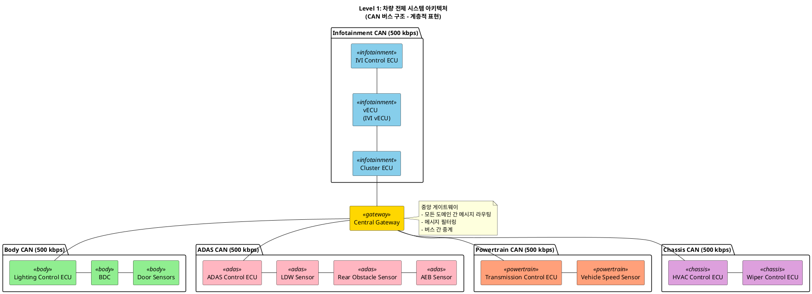
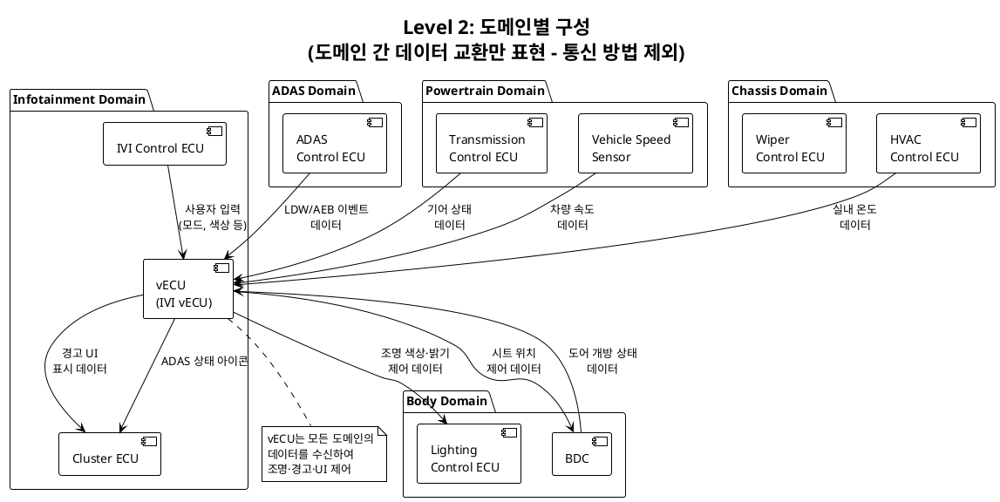
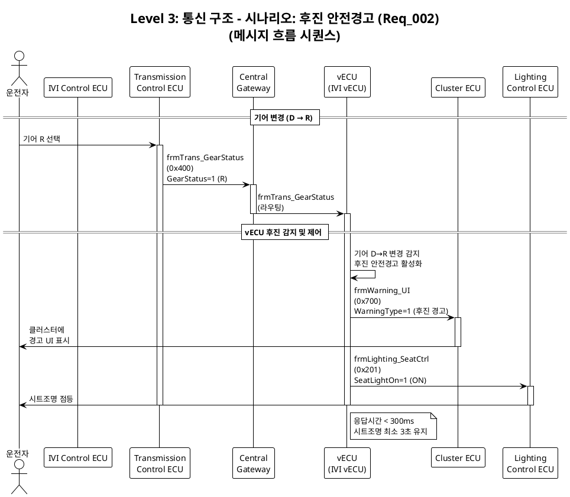
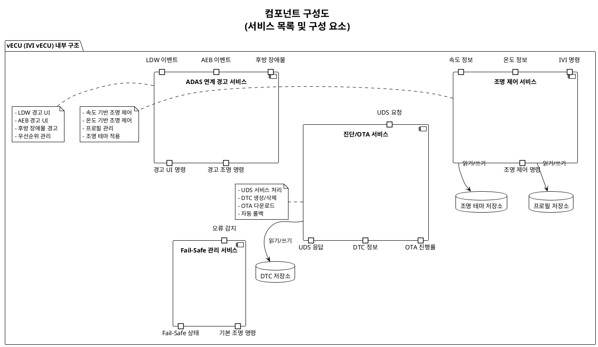

# 02_Concept Design (컨셉 디자인) 가이드

> **작성 기준**: 멘토 요구사항 준수 (수작업 다이어그램)
> **작성일**: 2026-02-13
> **목적**: PPT/Visio로 그릴 때 참고용

---

## 📐 그려야 할 다이어그램

1. **Level 1**: 차량 전체 시스템 아키텍처 (CAN 버스 구조)
2. **Level 2**: 도메인별 구성 (데이터 교환)
3. **Level 3**: 통신 구조 (메시지 흐름)
4. **컴포넌트 구성도**: 서비스 목록 및 구성 요소

---

## 🎨 Level 1: 차량 전체 시스템 아키텍처

### PlantUML 코드



### 수작업으로 그릴 때 포인트 (PPT/Visio)

1. **CAN 버스를 한 줄로 표현**
   ```
   ECU1 ━━━ ECU2 ━━━ ECU3 ━━━ Gateway
   ```
   ❌ 잘못된 표현 (이더넷 방식):
   ```
   ECU1 ─┐
   ECU2 ─┼─ Gateway
   ECU3 ─┘
   ```

2. **색상 구분**
   - Infotainment: 하늘색
   - Body: 녹색
   - ADAS: 분홍색
   - Powertrain: 주황색
   - Chassis: 보라색
   - Gateway: 금색 (강조)

3. **계층 구조**
   - 상단: Infotainment CAN
   - 중앙: Central Gateway (가장 중요)
   - 하단: 각 도메인 CAN (Body, ADAS, Powertrain, Chassis)

---

## 🎨 Level 2: 도메인별 구성 (데이터 교환)

### PlantUML 코드



### 수작업으로 그릴 때 포인트

1. **"데이터"만 표현 (통신 방법 X)**
   - ✅ "조명 색상·밝기 제어 데이터"
   - ❌ "CAN High Speed로 조명 제어 메시지 전송"

2. **화살표 방향**
   - 데이터 흐름 방향으로만 표시
   - 양방향은 피하고, 명확한 단방향으로

3. **vECU 중심 구조**
   - vECU가 중앙에 위치
   - 모든 도메인에서 데이터 수신
   - 필요한 제어 데이터 송신

---

## 🎨 Level 3: 통신 구조 (메시지 흐름)

### PlantUML 시퀀스 다이어그램



### 수작업으로 그릴 때 포인트

1. **시퀀스 다이어그램 형식**
   - 상단: 참여자(ECU)
   - 세로선: 시간 흐름
   - 화살표: 메시지 전송

2. **메시지 표현**
   ```
   송신자 → 수신자 : 메시지명 (ID)
                      신호명=값
   ```

3. **시나리오별 작성**
   - 시나리오 1: 후진 안전경고
   - 시나리오 2: 속도 기반 조명 변경
   - 시나리오 3: ADAS 연계 경고
   - 등등...

---

## 🎨 컴포넌트 구성도 (서비스 목록 및 구성 요소)

### PlantUML 컴포넌트 다이어그램



### 수작업으로 그릴 때 포인트

1. **서비스별 그룹화**
   - 큰 박스 안에 관련 서비스 배치
   - 조명 제어, ADAS 연계, 진단/OTA, Fail-Safe 등

2. **입출력 표시**
   - 왼쪽: 입력 포트
   - 오른쪽: 출력 포트

3. **데이터 저장소**
   - 원통형(DB 모양)으로 표현
   - 프로필, 조명 테마, DTC 저장소

---

## 📋 네트워크 구성 요약표

### 표 형식 (Excel/PPT 표)

| CAN 버스 | 속도 | 연결된 ECU | 주요 메시지 |
|---------|------|-----------|----------|
| **Infotainment CAN** | 500 kbps | IVI Control ECU<br>vECU (IVI vECU)<br>Cluster ECU | frmIVI_ModeSelect (0x100)<br>frmIVI_LightColorSet (0x101)<br>frmWarning_UI (0x700) |
| **Body CAN** | 500 kbps | Lighting Control ECU<br>BDC<br>Door Sensors | frmLighting_AmbientCtrl (0x200)<br>frmBDC_DoorStatus (0x210) |
| **ADAS CAN** | 500 kbps | ADAS Control ECU<br>LDW Sensor<br>AEB Sensor | frmADAS_LDW_Event (0x300)<br>frmADAS_AEB_Event (0x302) |
| **Powertrain CAN** | 500 kbps | Transmission Control ECU<br>Vehicle Speed Sensor | frmTrans_GearStatus (0x400)<br>frmVehicle_Speed (0x401) |
| **Chassis CAN** | 500 kbps | HVAC Control ECU<br>Wiper Control ECU | frmHVAC_Temp (0x500)<br>frmWiper_Status (0x501) |

---

## 🎯 PPT/Visio 작성 가이드

### 슬라이드 구성 (총 5장 권장)

1. **슬라이드 1: 표지**
   - 제목: "IVI vECU 프로젝트 컨셉 디자인"
   - 작성자, 작성일

2. **슬라이드 2: Level 1 - 차량 전체 시스템 아키텍처**
   - CAN 버스 구조 (계층적)
   - Central Gateway 중심
   - 도메인별 색상 구분

3. **슬라이드 3: Level 2 - 도메인별 구성**
   - 도메인 간 데이터 교환
   - vECU 중심 구조
   - 통신 방법 제외

4. **슬라이드 4: Level 3 - 통신 구조**
   - 시퀀스 다이어그램 (2~3개 시나리오)
   - 메시지 흐름 표현

5. **슬라이드 5: 컴포넌트 구성도**
   - vECU 내부 서비스 구조
   - 서비스 목록 및 구성 요소
   - 네트워크 구성 요약표

---

## 💡 Visio/PPT 팁

### Visio 사용 시

1. **도형 라이브러리**:
   - 기본 도형 → 사각형 (ECU)
   - 기본 도형 → 원통 (데이터베이스)
   - 커넥터 → 화살표 (데이터 흐름)

2. **스타일**:
   - 테마: "Office 테마" 또는 "모던"
   - 색상: 파스텔 톤 사용
   - 폰트: Malgun Gothic 또는 나눔고딕

3. **레이아웃**:
   - 자동 정렬 기능 활용
   - 균일한 간격 유지

### PowerPoint 사용 시

1. **도형 삽입**:
   - 삽입 → 도형 → 사각형 (ECU)
   - 삽입 → 도형 → 화살표 (데이터 흐름)

2. **SmartArt 활용**:
   - 계층 구조 → "조직도" 또는 "계층 구조"
   - 관계 → "기본 순환형"

3. **애니메이션** (선택):
   - 메시지 흐름을 순차적으로 보여주기
   - "나타내기" 효과 사용

---

## 🖼️ PlantUML 렌더링 방법

### 온라인에서 바로 보기

1. **PlantUML Online Server**
   - https://www.plantuml.com/plantuml/uml/
   - 위 코드 복사 → 붙여넣기 → 이미지 생성

2. **PlantText**
   - https://www.planttext.com/
   - 실시간 미리보기

3. **VS Code Extension**
   - PlantUML Extension 설치
   - `.puml` 파일 생성 → Alt+D로 미리보기

### 이미지 저장 방법

1. PlantUML 렌더링 후 우클릭 → "이미지 저장"
2. PNG 형식으로 저장
3. PPT/Visio에서 "삽입 → 그림"으로 배경 참고용으로 사용
4. 그 위에 수작업으로 다시 그리기

---

## 📌 멘토 피드백 체크리스트

그리기 전에 확인:

- [ ] CAN 버스 구조를 **한 줄로** 표현했는가? (이더넷 방식 ❌)
- [ ] 계층 구조가 명확한가? (Central Gateway가 중심)
- [ ] 도메인별 **데이터 교환**만 표현했는가? (통신 방법 제외)
- [ ] 메시지 흐름을 **시퀀스 다이어그램**으로 표현했는가?
- [ ] 화살표의 **의미**가 명확한가? (무엇을 전달하는지)
- [ ] **색상 구분**이 되어있는가? (도메인별)
- [ ] **주석/설명**이 충분한가? (Central Gateway 역할, vECU 역할 등)

---

**작성 완료 후**: QA 룸에 업로드 (일요일까지)
