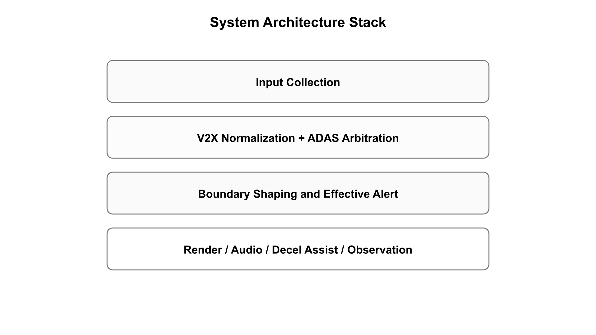

<div align="center">

# canoe-driving-alert

### CAN Communication Project in Hyundai Mobis Bootcamp with Vector Korea

A public repository for designing, verifying, and reviewing a driving-alert system in CANoe SIL.


[English](README.md) | [한국어](README.ko.md)

</div>

<p align="center">
  <strong>Hyundai Mobis Bootcamp</strong> · <strong>Vector Korea</strong>
</p>

<p align="center">
  <a href="#final-deliverables"><strong>Final Deliverables</strong></a> ·
  <a href="#overview"><strong>Overview</strong></a> ·
  <a href="#highlights"><strong>Highlights</strong></a> ·
  <a href="#system-overview"><strong>System Overview</strong></a> ·
  <a href="#quick-start"><strong>Quick Start</strong></a> ·
  <a href="#repository-map"><strong>Repository Map</strong></a>
</p>

<details>
<summary><strong>Project background</strong></summary>

This project was developed as part of the Hyundai Mobis Bootcamp in collaboration with Vector Korea.
It is structured as a public engineering repository that connects communication design, CANoe runtime assets, traceable workproducts, and verification tooling in one place.

</details>

<details>
<summary><strong>Major references</strong></summary>

- Vector CANoe documentation and sample configurations
- Automotive SPICE PAM 3.1
- ISO 26262
- AUTOSAR Classic Platform SWC Modeling Guide
- project-result review samples used to shape workproduct structure and reviewer-facing format

</details>

---

## Final Deliverables

The repository closeout surface is fixed to the six submission assets below.

<table>
  <tr>
    <td align="center" width="33%">
      <strong>1. Final Report</strong><br>
      <a href="final-deliverables/01_FINAL_REPORT.pdf">Open PDF</a><br>
      <sub>review-ready</sub>
    </td>
    <td align="center" width="33%">
      <strong>2. Presentation</strong><br>
      <a href="http://docs.google.com/presentation/d/1On3UPp9oFxr5yGK2zXpaYrwGLBa6OCgV/edit?usp=drive_web&ouid=115897220734400370363&rtpof=true">View online</a><br>
      <a href="final-deliverables/02_PRESENTATION.pptx">Download PPTX</a><br>
      <sub>online review + local mirror</sub>
    </td>
    <td align="center" width="33%">
      <strong>3. Short Paper</strong><br>
      <a href="final-deliverables/03_SHORT_PAPER.pdf">Open PDF</a><br>
      <sub>review-ready</sub>
    </td>
  </tr>
  <tr>
    <td align="center" width="33%">
      <strong>4. ECU Book</strong><br>
      <a href="final-deliverables/04_ECU_BOOK.pdf">Open PDF</a><br>
      <sub>review-ready</sub>
    </td>
    <td align="center" width="33%">
      <strong>5. Project Result Excel</strong><br>
      <a href="final-deliverables/05_PROJECT_RESULT_2-2.xlsx">Open XLSX</a><br>
      <sub>mapped from final 00~07_Docs workbook</sub>
    </td>
    <td align="center" width="33%">
      <strong>6. Appendix</strong><br>
      <a href="final-deliverables/06_APPENDIX.pdf">Open PDF</a><br>
      <sub>review-ready</sub>
    </td>
  </tr>
</table>

For source mapping and replacement policy, see [`final-deliverables/README.md`](final-deliverables/README.md).

## Overview

Most CAN communication repositories expose only one layer of the work: runtime assets, code, or test outputs.

This repository is built to show the full engineering path:

- communication design
- CANoe runtime implementation
- V-cycle workproducts
- verification execution and review tooling

## Highlights

- CAN + Ethernet communication modeling in CANoe SIL
- end-to-end traceability from requirement to verification
- operator-facing product surface for review workflows
- shared automation for gates, quality checks, and release support

## System Overview

The overview below uses the project-authored closeout figure rather than a generic placeholder diagram.



## Quick start

```powershell
python scripts/run.py
python scripts/run.py gate all
python scripts/run.py scenario run --id 4
python scripts/run.py verify quick --run-id 20260308_0900 --owner DEV2
```

## Repository map

| Path | Purpose |
| --- | --- |
| [`canoe/`](canoe/) | CANoe runtime project, configuration, CAPL source, contracts, and verification docs |
| [`driving-alert-workproducts/`](driving-alert-workproducts/) | canonical workproducts and traceable engineering documents |
| [`product/`](product/) | operator-facing product surface and review assets |
| [`scripts/`](scripts/) | shared launchers, gates, quality tooling, and release helpers |

## Start here

- [`canoe/README.md`](canoe/README.md)
- [`product/sdv_operator/README.md`](product/sdv_operator/README.md)
- [`product/sdv_operator/docs-src/index.md`](product/sdv_operator/docs-src/index.md)

## Contributing

See [`CONTRIBUTING.md`](CONTRIBUTING.md) for contribution guidance.

## Core architecture and ECU maps

If you want to understand why the architecture, ECU split, runtime ownership, and verification path are structured the way they are, start here:

- [ECU Classification](canoe/docs/architecture/ecu-classification.md)
- [Surface Map](canoe/docs/architecture/surface-runtime-verification-map.md)
- [Skeleton](canoe/docs/architecture/skeleton.md)
- [Communication Matrix](canoe/docs/contracts/communication-matrix.md)
- [Owner / Route](canoe/docs/contracts/owner-route.md)
- [Diagnostic Description](canoe/docs/contracts/diagnostic-description.md)
- [Panel and SysVar Contract](canoe/docs/contracts/panel-sysvar-contract.md)
- [Oracle](canoe/docs/verification/oracle.md)
- [Evidence Policy](canoe/docs/verification/evidence-policy.md)
