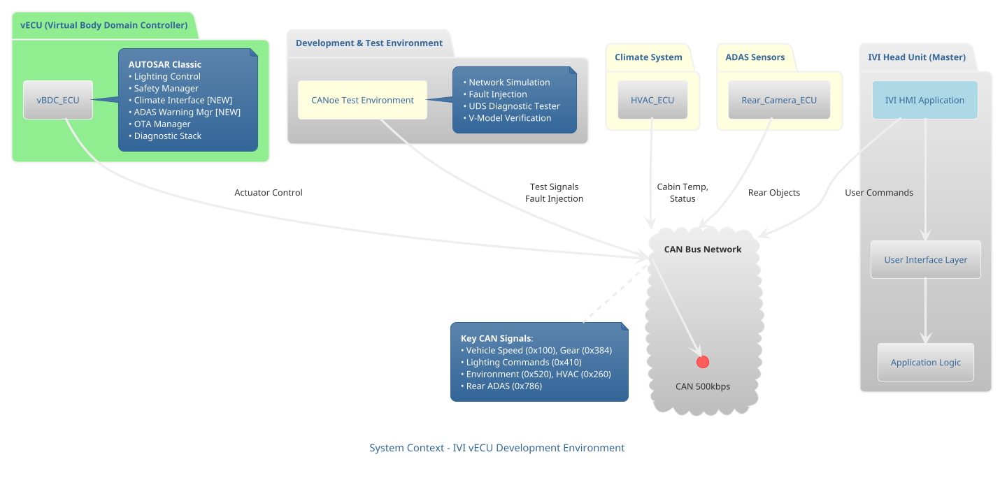
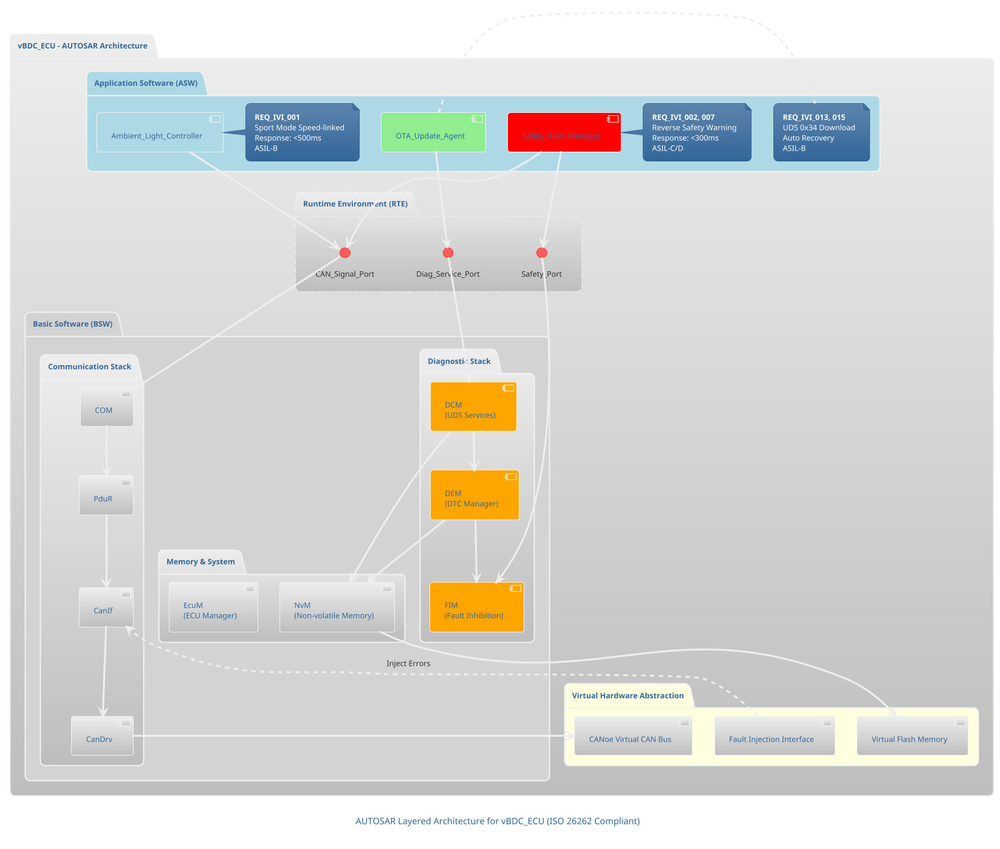
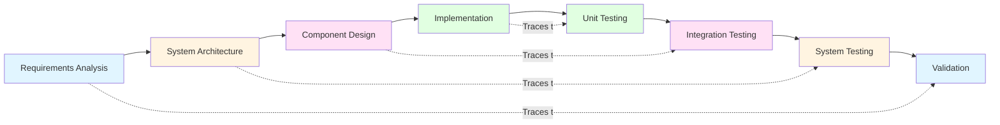

# IVI vECU System Architecture Overview

**Project**: CANoe-based Virtual ECU Development for IVI System
**Standards**: ISO 26262 (ASIL-D), AUTOSAR Classic, Automotive SPICE
**Development Environment**: Vector CANoe, V-Model Methodology

---

## 1. System Context

This architecture defines the virtual ECU (vECU) implementation for an In-Vehicle Infotainment (IVI) system, integrating lighting control, safety management, diagnostics, and OTA capabilities within a CANoe simulation environment.

---

## 2. AUTOSAR Layered Architecture

The vBDC_ECU follows AUTOSAR Classic architecture with clear separation between application software (ASW), runtime environment (RTE), and basic software (BSW).

---

## 3. Key System Components

### 3.1 Lighting Control Subsystem
- **Ambient Lighting Controller**: Sport mode and speed-linked color control
- **Dashboard Lighting**: Reverse safety and door-linked UX
- **Performance**: Color transition <500ms, synchronization >99%
- **Safety Level**: ASIL-B
- 📄 **Details**: See [Lighting Control Architecture](diagrams/lighting_control_architecture.md)

### 3.2 Safety Management Subsystem
- **Reverse Safety Manager**: ASIL-C/D critical path
- **Door Open Warning Logic**: Hazard detection during reverse
- **Auto Recovery**: Automatic state restoration
- **Performance**: Detection >99%, response <300ms
- 📄 **Details**: See [Safety System Architecture](diagrams/safety_system_architecture.md)

### 3.3 OTA & Diagnostic Subsystem
- **UDS Services**: 0x14 (Clear DTC), 0x34 (Request Download), 0x31 (Routine Control)
- **OTA Manager**: Software update with automatic rollback
- **DTC Management**: Fault detection and storage
- **Performance**: Success rate >98%, recovery 100%
- 📄 **Details**: See [OTA/Diagnostic Sequence](diagrams/ota_diagnostic_sequence.md)

### 3.4 Fault Injection & Testing
- **BDC Fault Injection**: Communication errors, sensor failures
- **DTC Generation**: Automatic fault code creation
- **CANoe Integration**: Bit/frame error injection
- 📄 **Details**: See [Fault Injection Workflow](diagrams/fault_injection_workflow.md)

### 3.5 CAN Communication Stack
- **Signal Mapping**: Speed, Gear, Door status
- **ComStack**: CanIf → PduR → Com → DCM
- **Timing Analysis**: Message latency <100ms
- 📄 **Details**: See [CAN Communication Stack](diagrams/can_communication_stack.md)

---

## 4. Requirements Traceability Matrix

| Requirement ID | Category | ASIL | Component | Diagram Reference |
|---|---|---|---|---|
| REQ_IVI_001 | Functional | ASIL-B | Ambient_Light_Controller | [Lighting Control](diagrams/lighting_control_architecture.md) |
| REQ_IVI_005 | Functional | QM | Ambient_Light_Controller | [Lighting Control](diagrams/lighting_control_architecture.md) |
| REQ_IVI_002 | Safety | ASIL-C | Safety_Alert_Manager | [Safety System](diagrams/safety_system_architecture.md) |
| REQ_IVI_029 | Safety | ASIL-B | Safety_Alert_Manager | [Safety System](diagrams/safety_system_architecture.md) |
| REQ_IVI_003 | Functional | ASIL-A | Dashboard_Lighting | [Lighting Control](diagrams/lighting_control_architecture.md) |
| REQ_IVI_051 | Functional | QM | IVI_HMI | [UI Architecture](diagrams/docs/lighting_control_architecture.md) |
| REQ_IVI_053 | Functional | QM | IVI_HMI | [UI Architecture](diagrams/docs/lighting_control_architecture.md) |
| REQ_IVI_054 | Functional | QM | IVI_HMI | [UI Architecture](diagrams/docs/lighting_control_architecture.md) |
| REQ_IVI_004 | Functional | QM | IVI_Sync_Manager | [Lighting Control](diagrams/lighting_control_architecture.md) |
| REQ_IVI_007 | Safety | ASIL-D | Door_Warning_Logic | [Safety System](diagrams/safety_system_architecture.md) |
| REQ_IVI_008 | Safety | ASIL-C | Auto_Recovery_Manager | [Safety System](diagrams/safety_system_architecture.md) |
| REQ_IVI_009 | Non-Functional | QM | ComStack | [CAN Stack](diagrams/can_communication_stack.md) |
| REQ_IVI_011 | Diagnostic | ASIL-B | DEM/FIM | [Fault Injection](diagrams/fault_injection_workflow.md) |
| REQ_IVI_012 | Diagnostic | ASIL-B | DCM (UDS 0x14) | [OTA/Diagnostic](diagrams/ota_diagnostic_sequence.md) |
| REQ_IVI_013 | Diagnostic | ASIL-B | OTA_Update_Agent | [OTA/Diagnostic](diagrams/ota_diagnostic_sequence.md) |
| REQ_IVI_015 | Diagnostic | ASIL-C | OTA_Recovery | [OTA/Diagnostic](diagrams/ota_diagnostic_sequence.md) |

---

## 5. Development Methodology

### V-Model Integration

### Verification Strategy

1. **SIL (Software-in-the-Loop)**: CANoe model-based testing
2. **HIL (Hardware-in-the-Loop)**: Safety-critical path validation (ASIL-C/D)
3. **Fault Injection Testing**: BDC communication error scenarios
4. **Integration Testing**: Full system verification with IVI HMI

---

## 6. Safety Considerations

### ASIL Decomposition

- **ASIL-D**: Door open warning during reverse (REQ_IVI_007)
- **ASIL-C**: Reverse safety alert, OTA recovery (REQ_IVI_002, 015)
- **ASIL-B**: Lighting control, diagnostic services (REQ_IVI_001, 011-013)
- **ASIL-A/QM**: Non-critical UX features (REQ_IVI_003, 004)

### Safety Mechanisms

- **Redundant Monitoring**: External watchdog for safety-critical functions
- **Graceful Degradation**: Fallback to audio warning if lighting fails
- **Automatic Recovery**: State restoration after fault conditions clear
- **DTC Logging**: All safety violations recorded for post-analysis

---

## 7. Next Steps

For detailed design of each subsystem, please refer to:

1. 🎨 [Lighting Control Architecture](diagrams/lighting_control_architecture.md)
2. 🛡️ [Safety System Architecture](diagrams/safety_system_architecture.md)
3. 🔄 [OTA/Diagnostic Sequence](diagrams/ota_diagnostic_sequence.md)
4. ⚠️ [Fault Injection Workflow](diagrams/fault_injection_workflow.md)
5. 📡 [CAN Communication Stack](diagrams/can_communication_stack.md)

---

**Document Version**: 1.0
**Last Updated**: 2026-02-08
**Author**: Architecture Team
**Review Status**: ✅ Approved for Implementation
