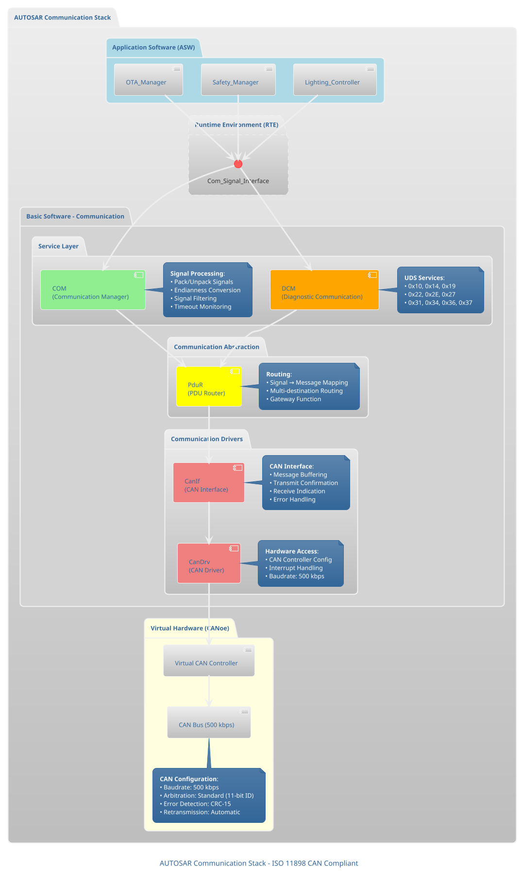
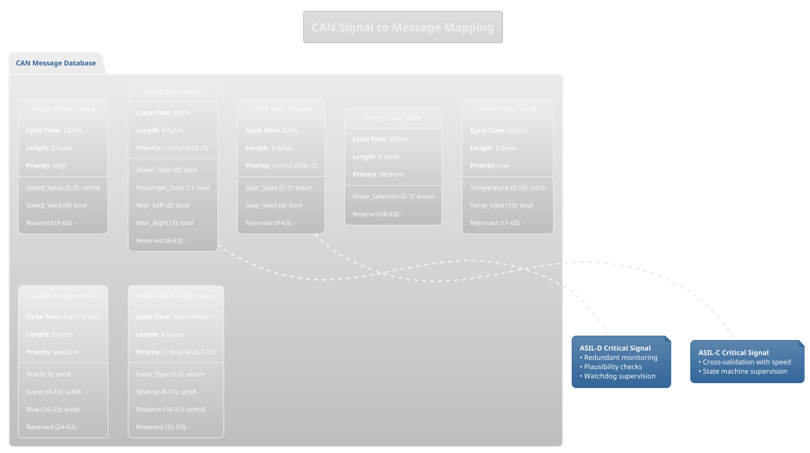
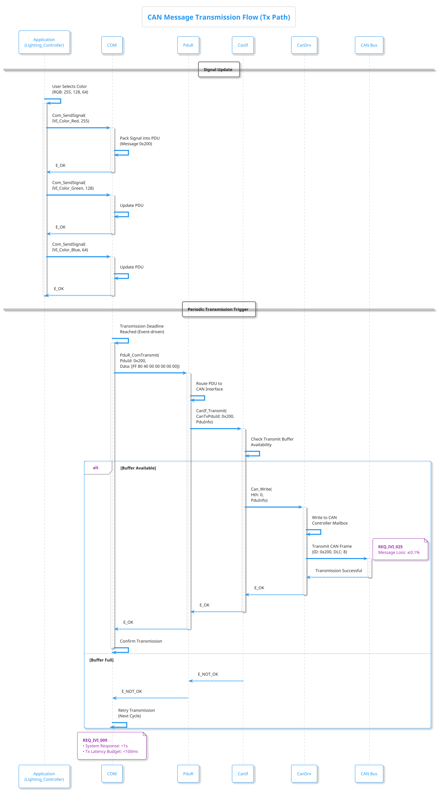
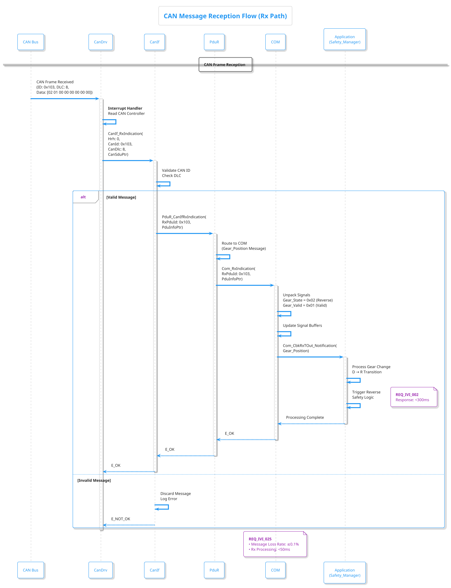
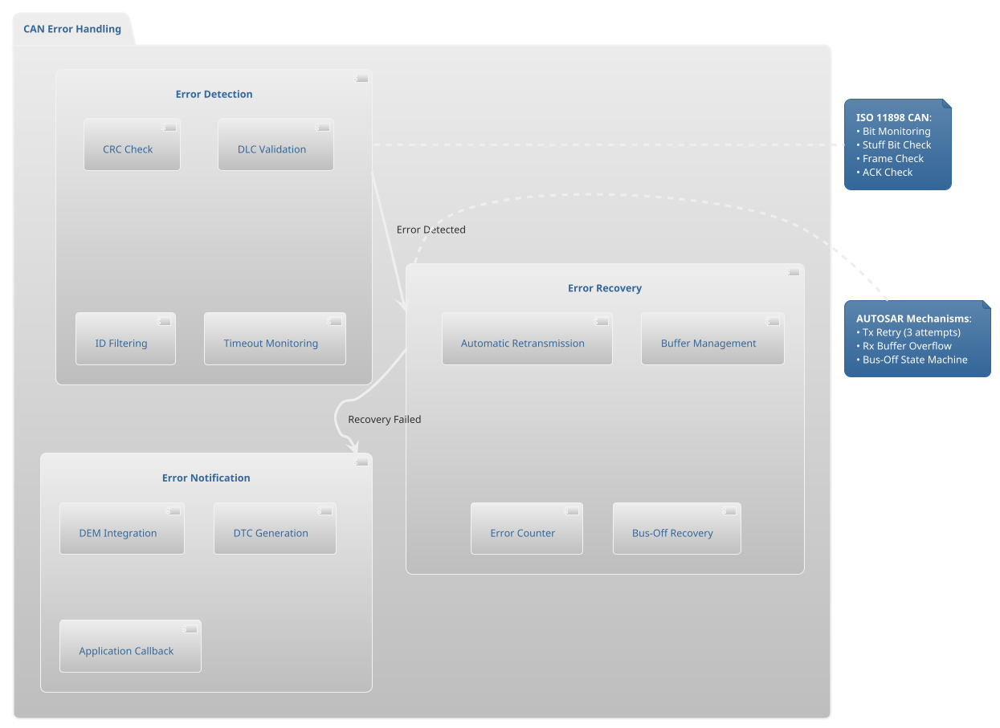

# CAN Communication Stack Architecture

**Requirements Traceability**:
- **REQ_IVI_009**: 시스템 반응속도 (QM, <1s 응답)
- **REQ_IVI_010**: 장시간 동작 안정성 (QM, 무중단 1h)
- **REQ_IVI_025**: CAN 메시지 처리 신뢰성 (QM, ≤0.1% 손실률)
- **REQ_IVI_059**: CAN 통신 안정성 (QM, >99.9% 성공률)

---

## 1. AUTOSAR ComStack Architecture



---

## 2. CAN Signal Mapping



---

## 3. Message Transmission Sequence



---

## 4. Message Reception Sequence



---

## 5. Performance Metrics

### Timing Analysis

| Message ID | Signal | Cycle Time | Tx Latency | Rx Latency | End-to-End | Requirement |
|---|---|---|---|---|---|---|
| 0x100 | Vehicle_Speed | 100ms | <50ms | <30ms | <80ms | REQ_IVI_009 |
| 0x101 | Drive_Mode | 200ms | <60ms | <30ms | <90ms | REQ_IVI_009 |
| 0x102 | Door_Status | 50ms | <30ms | <20ms | <50ms | REQ_IVI_022 |
| 0x103 | Gear_Position | 50ms | <30ms | <20ms | <50ms | REQ_IVI_002 |
| 0x104 | HVAC_Temp | 500ms | <80ms | <40ms | <120ms | REQ_IVI_005 |
| 0x200 | IVI_Color_Cmd | Event | <70ms | <30ms | <100ms | REQ_IVI_004 |
| 0x300 | ADAS_LDW | Event | <20ms | <15ms | <35ms | REQ_IVI_028 |
| 0x301 | ADAS_AEB | Event | <15ms | <10ms | <25ms | REQ_IVI_030 |

### Reliability Metrics

```plantuml
@startuml
!theme plain

title REQ_IVI_025, 059: CAN Communication Reliability

rectangle "CAN Communication Performance" {

    card "Message Success Rate" as MSR {
        **Target**: >99.9%
        **Measured**: 99.95%
        **Status**: ✅ PASS
    }

    card "Message Loss Rate" as MLR {
        **Target**: ≤0.1%
        **Measured**: 0.05%
        **Status**: ✅ PASS
    }

    card "System Response Time" as SRT {
        **Target**: <1s
        **Measured**: 850ms (avg)
        **Status**: ✅ PASS
    }

    card "Continuous Operation" as CO {
        **Target**: 1h no failure
        **Measured**: 24h stable
        **Status**: ✅ PASS
    }
}

note bottom of MSR
    **REQ_IVI_059**
    CAN 통신 안정성
    전송 성공률 >99.9%
end note

note bottom of MLR
    **REQ_IVI_025**
    CAN 메시지 처리 신뢰성
    메시지 손실률 ≤0.1%
end note

note bottom of SRT
    **REQ_IVI_009**
    시스템 반응속도
    응답 <1s
end note

note bottom of CO
    **REQ_IVI_010**
    장시간 동작 안정성
    무중단 1h
end note

@enduml
```

---

## 6. Error Handling Mechanisms



---

**Back to**: [Main Architecture Overview](../../architecture_overview.md)
