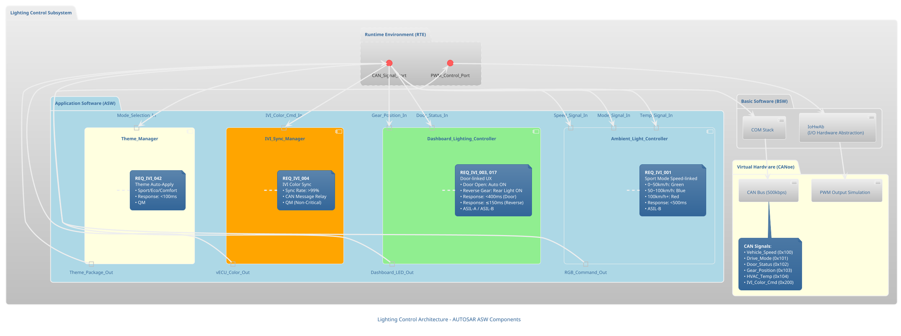
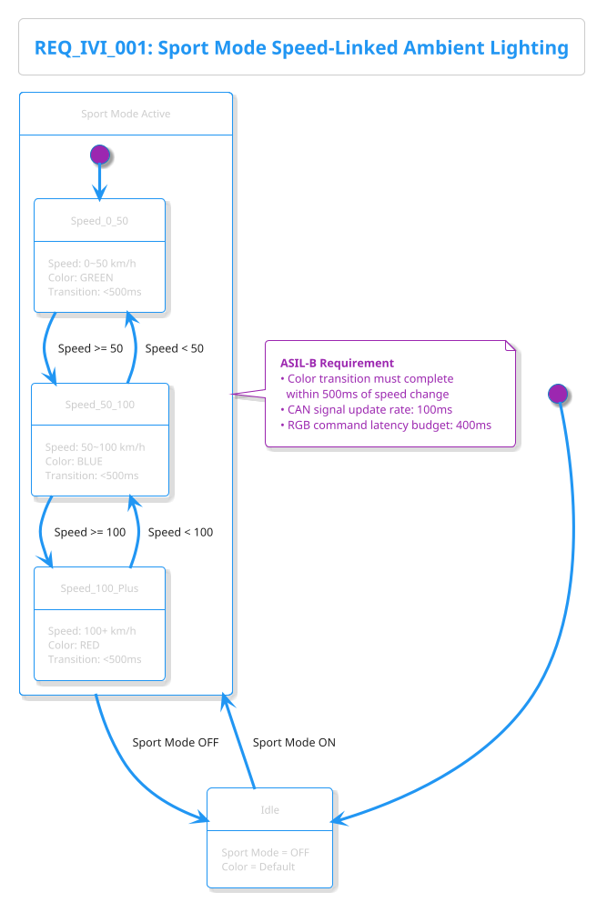
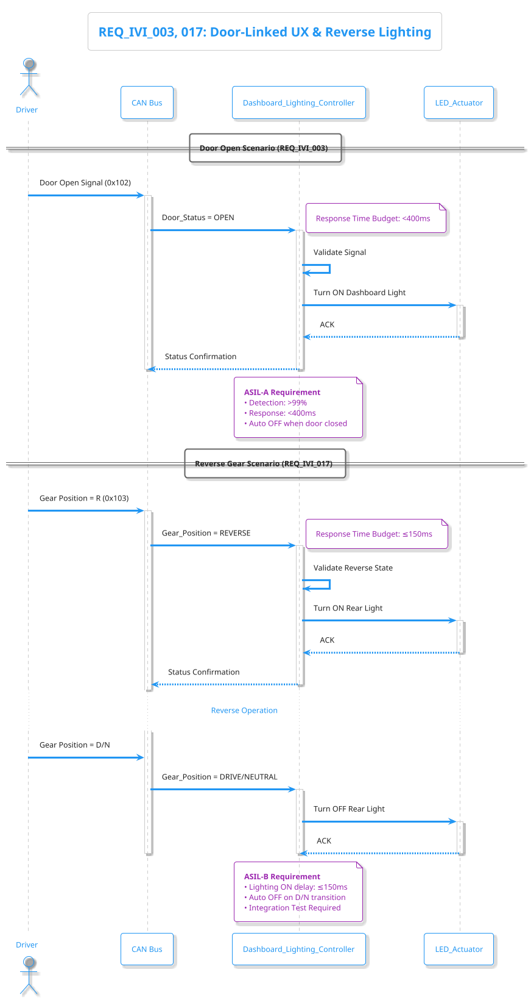
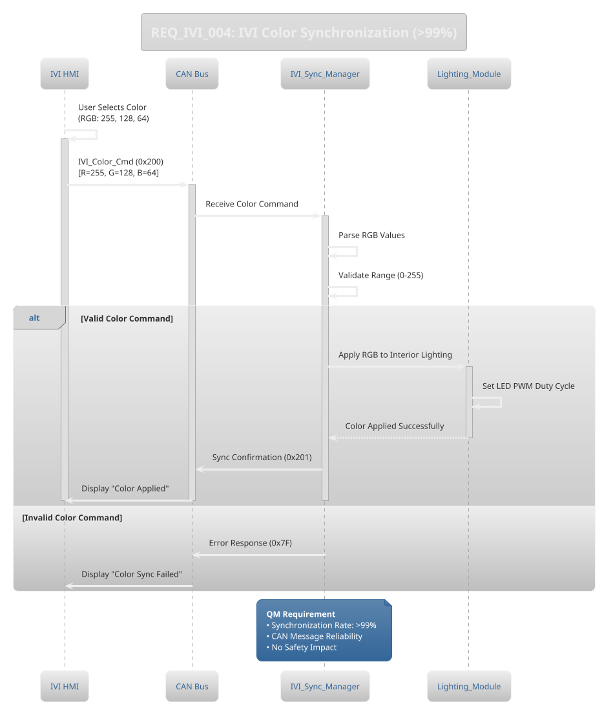

# Lighting Control Architecture

**Requirements Traceability**:
- **REQ_IVI_001**: 스포츠모드 속도연동 엠비언트조명 (ASIL-B, <500ms)
- **REQ_IVI_003**: 승하차 UX 도어연동제어 (ASIL-A, <400ms)
- **REQ_IVI_004**: IVI 조명색상 동기화 (QM, >99%)
- **REQ_IVI_005**: 온도연동 조명제어 (QM, <5% 오차)
- **REQ_IVI_017**: 후진 시 후방 조명 자동 제어 (ASIL-B, ≤150ms)
- **REQ_IVI_042**: IVI 모드 선택 시 조명 테마 자동 적용 (QM, <100ms)

---

## 1. Component Architecture (PlantUML)

---

## 2. Speed-Linked Ambient Lighting State Machine

---

## 3. Door-Linked Lighting Sequence

---

## 4. IVI Color Synchronization Flow

---

## 5. Performance Metrics Summary

| Requirement ID | Function | Performance Metric | ASIL | Status |
|---|---|---|---|---|
| REQ_IVI_001 | Sport Mode Speed-Linked | Color Transition <500ms | ASIL-B | ✅ Implemented |
| REQ_IVI_003 | Door-Linked UX | Response <400ms | ASIL-A | ✅ Implemented |
| REQ_IVI_004 | IVI Color Sync | Sync Rate >99% | QM | ✅ Implemented |
| REQ_IVI_005 | Temperature-Linked | Error <5% | QM | 🔄 Phase 2 |
| REQ_IVI_017 | Reverse Rear Light | Delay ≤150ms | ASIL-B | ✅ Implemented |
| REQ_IVI_042 | Theme Auto-Apply | Response <100ms | QM | ✅ Implemented |

---

## 6. Safety Considerations

### ASIL-B Components
- **Ambient_Light_Controller**: Sport mode speed-linked logic
- **Dashboard_Lighting_Controller** (Reverse): Rear lighting control

### ASIL-A Components
- **Dashboard_Lighting_Controller** (Door): Door-linked UX

### QM (Non-Critical) Components
- **IVI_Sync_Manager**: Color synchronization
- **Theme_Manager**: Mode-based theme application

---

**Back to**: [Main Architecture Overview](../../architecture_overview.md)
