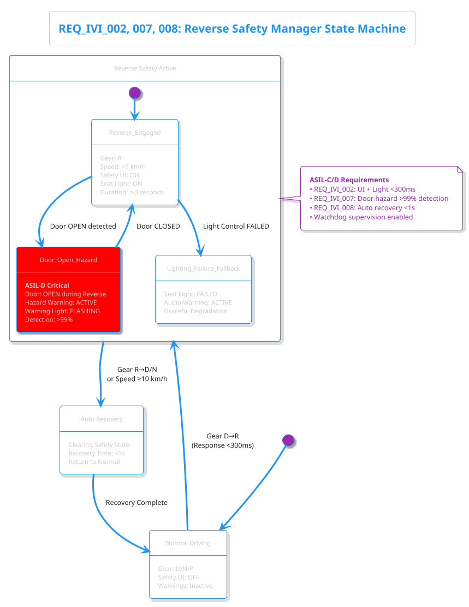
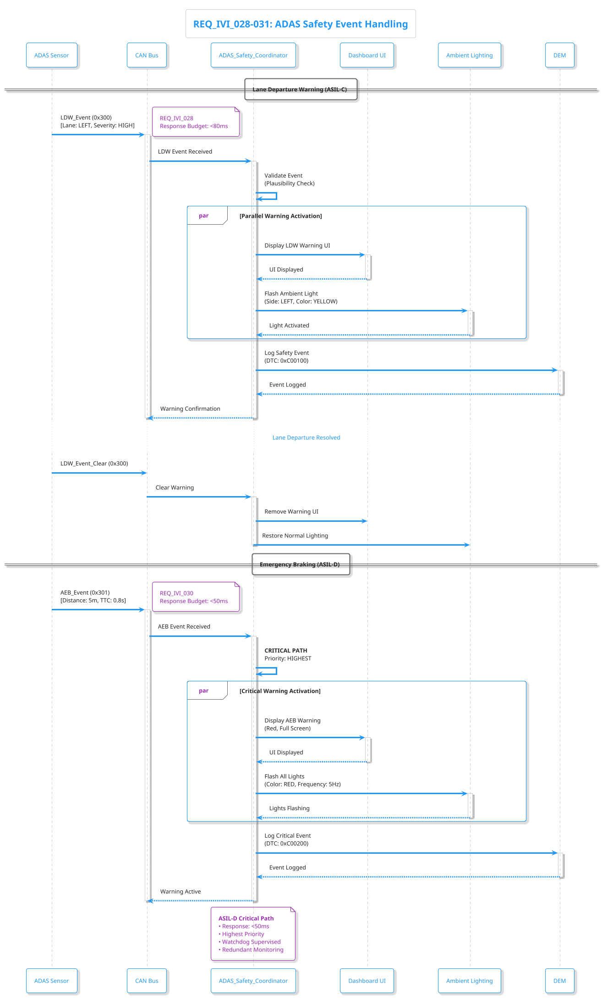
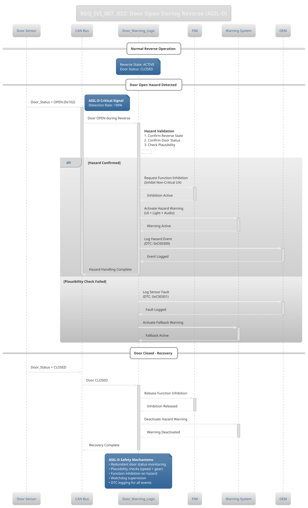

# Safety System Architecture

**Requirements Traceability**:
- **REQ_IVI_002**: 후진 안전경고 UI 및 시트조명 (ASIL-C, <300ms)
- **REQ_IVI_007**: 후진중 도어개방 경고제어 (ASIL-D, >99% 검출)
- **REQ_IVI_008**: 경고상태 자동복구기능 (ASIL-C, <1s 복구)
- **REQ_IVI_016**: 후진 기어 진입 시 UX 제어 기능 활성화 (ASIL-B, <100ms)
- **REQ_IVI_020**: 후진 경고음 제어 (ASIL-B, <100ms)
- **REQ_IVI_022**: 도어 오픈 시 후진 UX 제한 (ASIL-B, <100ms)
- **REQ_IVI_028-031**: ADAS 연계 시각적 경고 (ASIL-C/D, <80ms)
- **REQ_IVI_029**: 후진 시 후방 장애물 감지 및 경고 (ASIL-B, <100ms)
- **REQ_IVI_051**: 야간 승하차 안전 조명 시스템 (ASIL-B, <80ms)
- **REQ_IVI_054**: 어린이 보호 모드 통합 UX (ASIL-B, <200ms)

---

## 1. Safety System Component Architecture

```plantuml
@startuml
!theme silver
skinparam componentStyle uml2

package "Safety Management Subsystem" #FFCCCC {

    ' Application Layer - Safety Critical
    package "Application Software (ASW)" #Red {
        component "Reverse_Safety_Manager" as RSM #Red {
            portin "Gear_Position_In" as RSM_GEAR
            portin "Vehicle_Speed_In" as RSM_SPEED
            portout "Safety_UI_Cmd" as RSM_UI
            portout "Seat_Light_Cmd" as RSM_LIGHT
            portout "Audio_Warning_Cmd" as RSM_AUDIO

            note right of RSM
                **REQ_IVI_002 (ASIL-C)**
                Reverse Safety Alert
                • Detect: D → R transition
                • Response: <300ms
                • UI + Seat Light ON
                • Duration: ≥3 seconds
                • Fallback: Audio warning
            end note
        }

        component "Door_Warning_Logic" as DWL #DarkRed {
            portin "Door_Status_In" as DWL_DOOR
            portin "Reverse_State_In" as DWL_REV
            portout "Hazard_Warning_Out" as DWL_WARN

            note right of DWL
                **REQ_IVI_007 (ASIL-D)**
                Door Open During Reverse
                • Detection Rate: >99%
                • Response: Immediate
                • Hazard UI + Warning Light
                • Highest Safety Priority
            end note
        }

        component "Auto_Recovery_Manager" as ARM #Orange {
            portin "Safety_Condition_In" as ARM_COND
            portout "Recovery_Cmd_Out" as ARM_REC

            note right of ARM
                **REQ_IVI_008 (ASIL-C)**
                Auto Recovery
                • Trigger: Reverse END or Door CLOSED
                • Recovery Time: <1s
                • Return to Normal Mode
            end note
        }

        component "ADAS_Safety_Coordinator" as ASC #LightCoral {
            portin "LDW_Event_In" as ASC_LDW
            portin "AEB_Event_In" as ASC_AEB
            portin "BSD_Event_In" as ASC_BSD
            portout "Visual_Warning_Out" as ASC_WARN

            note right of ASC
                **REQ_IVI_028-031 (ASIL-C/D)**
                ADAS Integration
                • Lane Departure: <80ms
                • Emergency Braking: <50ms
                • Blind Spot: <70ms
                • Dashboard + Ambient Lighting
            end note
        }

        component "Child_Protection_Manager" as CPM #Pink {
            portin "Rear_Occupancy_In" as CPM_OCC
            portin "Ignition_State_In" as CPM_IGN
            portout "Protection_Mode_Out" as CPM_MODE

            note right of CPM
                **REQ_IVI_054 (ASIL-B)**
                Child Protection Mode
                • Rear Seat Monitoring
                • Door Lock + Lighting
                • Response: <200ms
            end note
        }
    }

    ' RTE Layer
    package "Runtime Environment (RTE)" #line.dashed {
        interface "Safety_Signal_Port" as SSP
        interface "Warning_Output_Port" as WOP

        SSP --> RSM_GEAR
        SSP --> RSM_SPEED
        SSP --> DWL_DOOR
        SSP --> DWL_REV
        SSP --> ARM_COND
        SSP --> ASC_LDW
        SSP --> ASC_AEB
        SSP --> ASC_BSD
        SSP --> CPM_OCC
        SSP --> CPM_IGN

        RSM_UI --> WOP
        RSM_LIGHT --> WOP
        RSM_AUDIO --> WOP
        DWL_WARN --> WOP
        ARM_REC --> WOP
        ASC_WARN --> WOP
        CPM_MODE --> WOP
    }

    ' BSW Layer - Safety Mechanisms
    package "Basic Software (BSW)" #LightGray {
        component "FIM\n(Function Inhibition Manager)" as FIM #Orange
        component "DEM\n(Diagnostic Event Manager)" as DEM #Orange
        component "WdgM\n(Watchdog Manager)" as WDGM #Red

        WOP --> FIM
        FIM --> DEM
        FIM --> WDGM

        note bottom of FIM
            **Safety Mechanisms**:
            • Function Inhibition on Fault
            • DTC Generation (0xC00000-0xC0FFFF)
            • Watchdog Supervision
        end note
    }

    ' Virtual Hardware
    package "Virtual Hardware (CANoe)" #LightYellow {
        component "CAN Bus (Safety Critical)" as CAN_SAFE
        component "Fault Injection Interface" as FI

        SSP --> CAN_SAFE
        FI ..> CAN_SAFE : Inject Faults

        note bottom of CAN_SAFE
            **Safety CAN Signals**:
            • Gear_Position (0x384) - ASIL-D
            • Door_Status (0x512) - ASIL-D
            • Vehicle_Speed (0x100) - ASIL-B
            • Rear_Objects (0x786) - ASIL-B
            • ADAS_Events (0x300-0x30F) - ASIL-C/D
        end note
    }
}

caption Safety System Architecture - ISO 26262 ASIL-D Compliant
@enduml
```

---

## 2. Reverse Safety State Machine (ASIL-C)

---

## 3. ADAS Safety Integration Sequence

---

## 4. Door Open Hazard Detection (ASIL-D)

---

## 5. Safety Metrics Summary

| Requirement ID | Function | Performance | ASIL | Verification |
|---|---|---|---|---|
| REQ_IVI_002 | Reverse Safety Alert | <300ms | ASIL-C | SIL + HIL |
| REQ_IVI_007 | Door Open Hazard | >99% detection | **ASIL-D** | HIL + FI |
| REQ_IVI_008 | Auto Recovery | <1s | ASIL-C | SIL |
| REQ_IVI_016 | Reverse UX Activation | <100ms | ASIL-B | SIL |
| REQ_IVI_020 | Reverse Warning Sound | <100ms | ASIL-B | Integration Test |
| REQ_IVI_022 | Door UX Restriction | <100ms | ASIL-B | FI Test |
| REQ_IVI_028 | Lane Departure Warning | <80ms | ASIL-C | SIL + FI |
| REQ_IVI_029 | Rear Object Warning | <100ms | ASIL-B | SIL + FI |
| REQ_IVI_030 | Emergency Braking | <50ms | **ASIL-D** | HIL + FI |
| REQ_IVI_051 | Night Safety Lighting | <80ms | ASIL-B | HIL + FI |
| REQ_IVI_054 | Child Protection Mode | <200ms | ASIL-B | HIL |

---

## 6. Safety Mechanisms (ISO 26262)

### ASIL-D Safety Mechanisms
1. **Redundant Monitoring**: Door status validated by multiple sources
2. **Plausibility Checks**: Cross-validation with speed and gear position
3. **Watchdog Supervision**: All ASIL-D functions supervised by WdgM
4. **Function Inhibition**: Non-critical functions disabled during hazard
5. **DTC Logging**: All safety events logged with timestamps

### Graceful Degradation
- **Lighting Failure**: Fallback to audio warning (REQ_IVI_002)
- **Sensor Fault**: Use last known valid state + warning
- **CAN Timeout**: Enter safe state (all warnings ON)

### Verification Strategy
- **SIL**: Software-in-the-Loop for logic validation
- **HIL**: Hardware-in-the-Loop for ASIL-C/D paths
- **FI**: Fault Injection for >99% detection validation

---

**Back to**: [Main Architecture Overview](../../architecture_overview.md)
