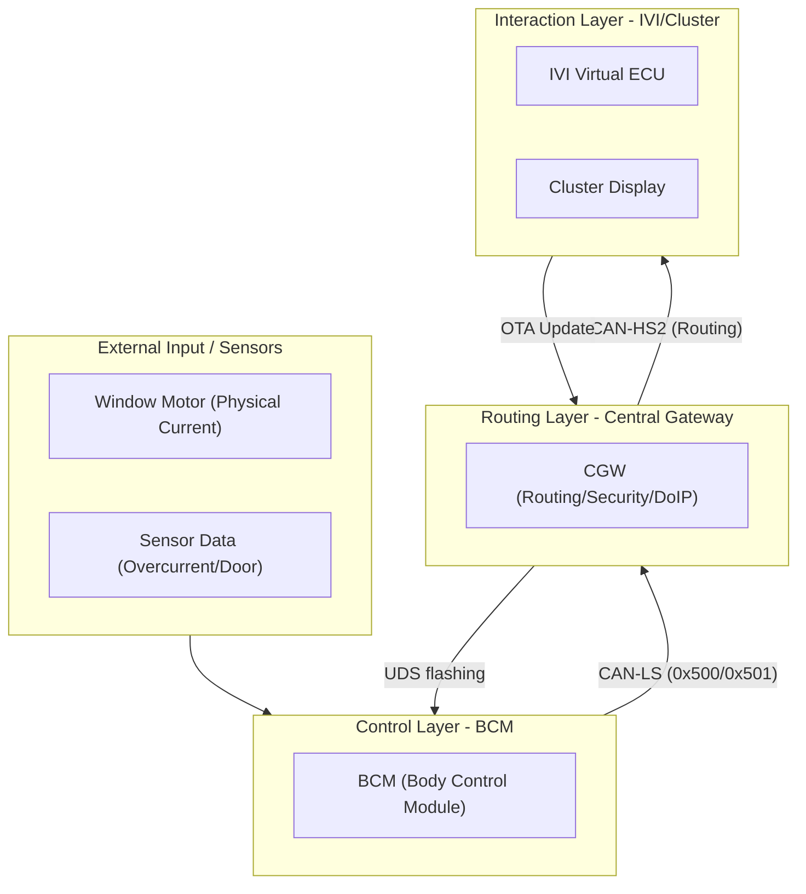
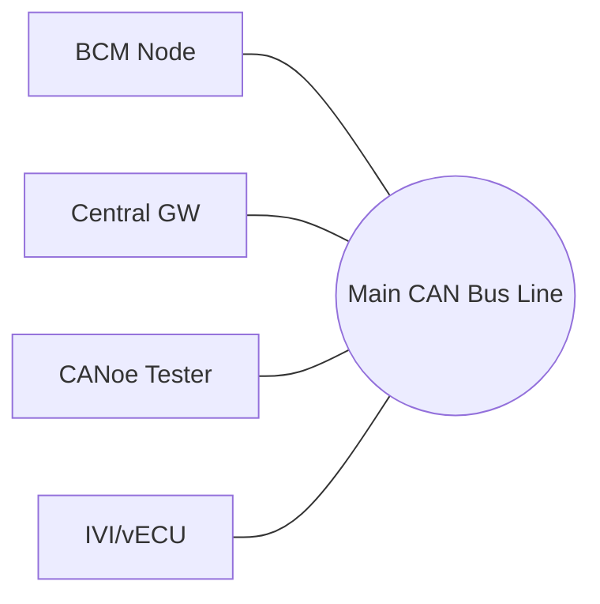

# 🚗 Automotive Network Architecture Textbook (Baseline v1.2)

이 문서는 멘토님의 피드백을 반영하여 본 프로젝트의 차량 네트워크 아키텍처를 '교과서' 수준으로 정립한 가이드입니다. 본 프로젝트의 전체 흐름(Red Thread)을 이해하는 핵심 레퍼런스로 활용하십시오.

---

## 1. 계층 구조 (Hierarchical Layering) 📐

차량 네트워크는 단순한 연결이 아닌 **기능적/물리적 계층**을 가집니다.

> [!IMPORTANT]
> **Key Point**: 게이트웨이(CGW)는 모든 도메인 간의 '심판'이자 '라우터' 역할을 하며, 실제 제어 로직은 도메인 ECU(BCM 등)가 수행합니다.

---

## 2. 네트워크 토폴로지 (Network Topology) 🕸️

### ❌ 잘못된 이해: Star Topology (1:1 Ethernet 방식)
모든 ECU가 중앙 게이트웨이와 1:1로 직접 연결된 구조입니다. 설계는 쉽지만 배선 중량이 매우 무겁고 하네스 비용이 급증하여 양산차에서는 특수한 경우(Ethernet 등)에만 제한적으로 사용합니다.

### ✅ 올바른 이해: Bus Topology (Shared CAN 방식)
모든 노드가 **하나의 공통 트위스트 페어 라인**을 공유하며 데이터가 브로드캐스팅됩니다. 본 프로젝트에서 BCM, CGW, Tester는 이 공통 버스를 통해 대화합니다.

- **장점**: 배선 수량 획기적 절감, 새로운 노드 추가 시 배선 공사 최소화.
- **특징**: CSMA/CA 방식. ID가 낮을수록(예: 0x100 > 0x500) 우선순위가 높으며, 충돌 시 낮은 ID가 버스 점유권을 가집니다.

---

## 3. I-C-O Flow 시나리오: Window Motor Fault ⚡

실제 프로젝트 시나리오를 통해 데이터가 어떻게 흐르는지(Input-Control-Output) 확인합니다.

| 단계 | 역할 (Role) | 데이터 (ID/Signal) | 설명 |
| :--- | :--- | :--- | :--- |
| **Input** | Physical Signal | **Motor Current > 50A** | 윈도우 모터 부하 임계값 초과 |
| **Control 1** | BCM Decision | **DTC B1234 생성** | BCM 내부 로직에 의해 결함 확정 |
| **Output 1** | CAN LS Send | **0x500 (BCM_FaultStatus)** | 버스에 결함 신호 브로드캐스팅 (10ms 주기) |
| **Routing** | CGW Bridge | **CAN-LS → HS2/HS1** | LS 버스의 신호를 다른 고속 버스로 전송 |
| **Control 2** | IVI / vECU | **User UX Logic** | 수신된 신호를 기반으로 "경고 노출" 판단 |
| **Output 2** | User Display | **0x420 (vECU_WarningUI)** | 클러스터 화면에 팝업 및 경고 아이콘 표출 |

---

## 4. 핵심 DBC 메시지 매핑 (DBC Mapping) 📑

본 프로젝트의 통신 프로토콜을 관통하는 핵심 ID 리스트입니다.

| CAN ID (Hex) | 이름 | 송신 노드 | ASIL | 주요 신호 |
| :--- | :--- | :--- | :--- | :--- |
| **0x500** | `BCM_FaultStatus` | BCM | B | `WindowMotorOvercurrent`, `DTC_Code` |
| **0x501** | `BCM_DoorStatus` | BCM | QM | `DoorOpenStatus_FL/RL/FR/RR` |
| **0x420** | `vECU_WarningUI` | IVI/vECU | D | `Warning_Type`, `Warning_Active` |

---

## 5. 진단 및 OTA 아키텍처 (UDS & OTA) 🛠️

네트워크 계층을 통해 소프트웨어를 업데이트하는 구조입니다.

1. **UDS Tester**: 0x10 0x03 (Extended) 세션을 통해 BCM에 진단 권한 요청.
2. **Read DTC**: 0x19 0x02 서비스를 통해 BCM 내부에 저장된 B1234 코드 읽기.
3. **OTA Flashing**: Ethernet(DoIP) 또는 CAN을 통해 0x34/0x36/0x37 프로토콜로 새로운 펌웨어 전송.
4. **Validation**: 업데이트 완료 후 BCM 재부팅 및 DTC 소거 상태 확인.

---

> [!TIP]
> 아키텍처 다이어그램을 그릴 때는 **"데이터의 발생원(BCM Sensor) → 핵심 판단(BCM Logic) → 전달(CGW) → 사용자 인터페이스(IVI)"**의 4단계를 명확히 구분하는 것이 중요합니다.
