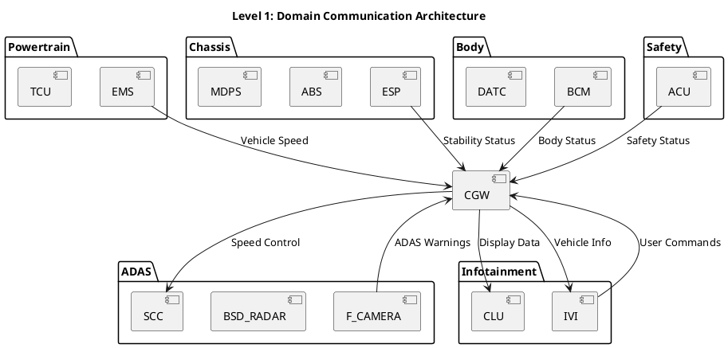

# DBC 기반 아키텍처 재정의 계획 (Level 1-4)

## 🎯 목표

**OpenDBC 기반 프로덕션급 아키텍처 재정의**: Tier1 Best Practice 벤치마킹

---

## 📊 현재 상태 분석

### DBC 파일 현황
- ✅ `hyundai_kia_base.dbc`: 1676 lines, 47 ECU, 146 messages, 1325 signals
- ✅ `vehicle_system_custom.dbc`: 103 lines, 3 messages (앰비언트 라이팅)

### 기존 아키텍처 현황
```
architecture/system-architecture/diagrams/
├── level1_vehicle_system/  (2 files)
├── level2_domain/          (empty)
├── level3_communication/   (1 file)
└── level4_ivi_ecu/        (29 files)
```

**문제점**:
- ❌ Level 1: DBC와 불일치 (11 ECU vs 47 ECU)
- ❌ Level 2: 도메인 분류 없음
- ❌ Level 3: 통신 시나리오 부족
- ❌ Level 4: IVI 중심 (전체 ECU 미커버)

---

## 🏗️ 재정의 전략

### 핵심 원칙

1. **DBC 기반 설계**: OpenDBC 47 ECU를 기준으로 아키텍처 재구성
2. **Tier1 BP 벤치마킹**: Hyundai/Mobis 표준 준수
3. **도메인 중심 분류**: ISO 26262 도메인 분류 적용
4. **확장성**: 향후 ECU 추가 용이

---

## 📋 Level 1: 차량 시스템 개요 (Vehicle System Overview)

### 목표
**47개 ECU를 도메인별로 분류하여 전체 차량 아키텍처 표현**

### Tier1 BP: Hyundai/Mobis 도메인 분류

#### 1. Powertrain Domain (동력계)
```
EMS     (Engine Management System)
TCU     (Transmission Control Unit)
OPI     (Oil Pump Inverter)
LPI     (LPG Injection)
FPCM    (Fuel Pump Control Module)
REA     (Rear Engine Actuator)
AAF     (Active Air Flap)
```

#### 2. Chassis Domain (섀시)
```
ESP     (Electronic Stability Program)
ABS     (Anti-lock Braking System)
MDPS    (Motor Driven Power Steering)
SAS     (Steering Angle Sensor)
EPB     (Electronic Parking Brake)
ECS     (Electronic Control Suspension)
```

#### 3. ADAS Domain (첨단 운전자 지원)
```
F_CAMERA    (Front Camera - LDWS/LKAS)
BSD_RADAR   (Blind Spot Detection - LCA)
SCC         (Smart Cruise Control)
SPAS        (Smart Parking Assist System)
AVM         (Around View Monitor)
PGS         (Parking Guidance System)
SNV         (Surround Night Vision)
```

#### 4. Body Domain (바디)
```
BCM     (Body Control Module)
DATC    (Dual Auto Temperature Control)
FATC    (Full Auto Temperature Control)
AFLS    (Adaptive Front Lighting System)
AHLS    (Adaptive High-beam Light System)
PSB     (Pre-Safe Belt)
TPMS    (Tire Pressure Monitoring System)
```

#### 5. Infotainment Domain (인포테인먼트)
```
IVI     (In-Vehicle Infotainment - IBOX)
CLU     (Cluster Unit)
HUD     (Head-Up Display)
TMU     (Telematics Unit)
CUBIS   (Connected User Box Infotainment System)
```

#### 6. Safety Domain (안전)
```
ACU     (Airbag Control Unit)
ODS     (Occupant Detection System)
```

#### 7. Gateway Domain (게이트웨이)
```
CGW     (Central Gateway)
```

#### 8. Others (기타)
```
SMK     (Smart Key)
LVR     (Lever)
EVP     (Electric Vacuum Pump)
DI_BOX  (Direct Injection Box)
_4WD    (4-Wheel Drive Control)
MTS     (Manual Transmission System)
AEMC    (Active Engine Mount Control)
```

### Level 1 다이어그램 구성

#### 1.1 전체 시스템 개요 (`01_vehicle_system_overview.puml`)
```plantuml
@startuml
!include https://raw.githubusercontent.com/plantuml-stdlib/C4-PlantUML/master/C4_Container.puml

title Level 1: Vehicle System Architecture (47 ECU)

' Powertrain Domain
System_Boundary(powertrain, "Powertrain Domain") {
    Container(EMS, "EMS", "ECU", "Engine Management")
    Container(TCU, "TCU", "ECU", "Transmission Control")
    Container(OPI, "OPI", "ECU", "Oil Pump Inverter")
    Container(LPI, "LPI", "ECU", "LPG Injection")
}

' Chassis Domain
System_Boundary(chassis, "Chassis Domain") {
    Container(ESP, "ESP", "ECU", "Electronic Stability")
    Container(ABS, "ABS", "ECU", "Anti-lock Braking")
    Container(MDPS, "MDPS", "ECU", "Power Steering")
    Container(EPB, "EPB", "ECU", "Parking Brake")
}

' ADAS Domain
System_Boundary(adas, "ADAS Domain") {
    Container(F_CAMERA, "F_CAMERA", "ECU", "Front Camera")
    Container(BSD_RADAR, "BSD_RADAR", "ECU", "Blind Spot Radar")
    Container(SCC, "SCC", "ECU", "Smart Cruise Control")
    Container(SPAS, "SPAS", "ECU", "Parking Assist")
}

' Body Domain
System_Boundary(body, "Body Domain") {
    Container(BCM, "BCM", "ECU", "Body Control")
    Container(DATC, "DATC", "ECU", "Climate Control")
    Container(TPMS, "TPMS", "ECU", "Tire Pressure")
}

' Infotainment Domain
System_Boundary(infotainment, "Infotainment Domain") {
    Container(IVI, "IVI", "ECU", "Infotainment")
    Container(CLU, "CLU", "ECU", "Cluster")
    Container(HUD, "HUD", "ECU", "Head-Up Display")
}

' Safety Domain
System_Boundary(safety, "Safety Domain") {
    Container(ACU, "ACU", "ECU", "Airbag Control")
    Container(ODS, "ODS", "ECU", "Occupant Detection")
}

' Gateway
Container(CGW, "CGW", "ECU", "Central Gateway")

' CAN Networks
Rel(EMS, CGW, "CAN-HS #1", "Powertrain")
Rel(ESP, CGW, "CAN-HS #1", "Chassis")
Rel(F_CAMERA, CGW, "CAN-HS #2", "ADAS")
Rel(BCM, CGW, "CAN-LS", "Body")
Rel(IVI, CGW, "CAN-HS #2", "Infotainment")
Rel(ACU, CGW, "CAN-HS #1", "Safety")

@enduml
```

#### 1.2 도메인 간 통신 (`02_domain_communication.puml`)


---

## 📋 Level 2: 도메인별 아키텍처 (Domain Architecture)

### 목표
**각 도메인별 상세 ECU 구성 및 내부 통신 정의**

### 2.1 Powertrain Domain (`level2_powertrain.puml`)

**ECU 목록**:
- EMS (Engine Management System)
- TCU (Transmission Control Unit)
- OPI (Oil Pump Inverter)
- LPI (LPG Injection)
- FPCM (Fuel Pump Control Module)
- REA (Rear Engine Actuator)
- AAF (Active Air Flap)

**주요 메시지** (OpenDBC 기반):
```
EMS → TCU: Engine RPM, Torque
TCU → EMS: Gear Position, Shift Request
EMS → CGW: Vehicle Speed, Engine Status
OPI → EMS: Oil Pump Status
```

### 2.2 Chassis Domain (`level2_chassis.puml`)

**ECU 목록**:
- ESP (Electronic Stability Program)
- ABS (Anti-lock Braking System)
- MDPS (Motor Driven Power Steering)
- SAS (Steering Angle Sensor)
- EPB (Electronic Parking Brake)
- ECS (Electronic Control Suspension)

**주요 메시지**:
```
ESP → ABS: Brake Request
MDPS → ESP: Steering Angle
SAS → MDPS: Angle Sensor Data
EPB → ESP: Parking Brake Status
```

### 2.3 ADAS Domain (`level2_adas.puml`)

**ECU 목록**:
- F_CAMERA (Front Camera - LDWS/LKAS)
- BSD_RADAR (Blind Spot Detection - LCA)
- SCC (Smart Cruise Control)
- SPAS (Smart Parking Assist System)
- AVM (Around View Monitor)
- PGS (Parking Guidance System)
- SNV (Surround Night Vision)

**주요 메시지**:
```
F_CAMERA → IVI: LDW Warning, LKA Status
BSD_RADAR → BCM: Blind Spot Warning
SCC → ESP: Cruise Control Request
SPAS → MDPS: Steering Assist
```

### 2.4 Body Domain (`level2_body.puml`)

**ECU 목록**:
- BCM (Body Control Module)
- DATC/FATC (Climate Control)
- AFLS/AHLS (Lighting Systems)
- PSB (Pre-Safe Belt)
- TPMS (Tire Pressure Monitoring)

**주요 메시지**:
```
BCM → CLU: Door Status, Light Status
DATC → BCM: Climate Control Request
TPMS → CLU: Tire Pressure Warning
BCM → IVI: Ambient Light Control ⭐ (프로젝트 특화)
```

### 2.5 Infotainment Domain (`level2_infotainment.puml`)

**ECU 목록**:
- IVI (In-Vehicle Infotainment)
- CLU (Cluster Unit)
- HUD (Head-Up Display)
- TMU (Telematics Unit)
- CUBIS (Connected User Box)

**주요 메시지**:
```
IVI → BCM: Ambient Light RGB ⭐ (프로젝트 특화)
IVI → CLU: Media Info
CLU → HUD: Speed, Navigation
TMU → IVI: Connectivity Status
```

---

## 📋 Level 3: 통신 구조 및 시나리오 (Communication Architecture)

### 목표
**CAN 네트워크 토폴로지 및 메시지 플로우 정의**

### 3.1 CAN 네트워크 토폴로지 (`level3_can_topology.puml`)

**네트워크 분류** (Tier1 BP):
```
CAN-HS #1 (500 kbps):
  - Powertrain: EMS, TCU, OPI, LPI
  - Chassis: ESP, ABS, MDPS, EPB
  - Safety: ACU, ODS

CAN-HS #2 (500 kbps):
  - ADAS: F_CAMERA, BSD_RADAR, SCC, SPAS, AVM
  - Infotainment: IVI, CLU, HUD, TMU

CAN-LS (125 kbps):
  - Body: BCM, DATC, FATC, AFLS, TPMS
  - Comfort: SMK, LVR, PSB

Gateway (CGW):
  - Routing between CAN-HS #1, #2, and CAN-LS
```

### 3.2 통신 시나리오 (`level3_message_scenarios.puml`)

#### 시나리오 1: 속도 표시 (OpenDBC)
```
EMS (0x316) → Vehicle_Speed → CGW → CLU
- Message: EMS16
- Signal: Vehicle_Speed (km/h)
- Cycle: 10ms
```

#### 시나리오 2: ADAS 경고 (OpenDBC)
```
F_CAMERA (0x420) → LDW_Warning → CGW → IVI
- Message: LDWS_LKAS11
- Signal: LDW_Status, LKA_Event
- Cycle: 100ms
```

#### 시나리오 3: 앰비언트 라이팅 (프로젝트 특화)
```
IVI (0x400) → Ambient_Light_RGB → BCM (0x520) → CLU
- Message: IVI_AmbientLight, BCM_LightControl
- Signal: RGB, Brightness, Theme
- Cycle: 100ms
```

### 3.3 DBC 파일 통합
- ✅ `hyundai_kia_base.dbc` (OpenDBC 원본)
- ✅ `vehicle_system_custom.dbc` (프로젝트 특화)

---

## 📋 Level 4: ECU 상세 설계 (ECU Detailed Design)

### 목표
**주요 ECU별 내부 구조 및 소프트웨어 아키텍처 정의**

### 4.1 IVI ECU (프로젝트 핵심)

**소프트웨어 컴포넌트**:
```
IVI ECU
├── Application Layer
│   ├── Ambient Lighting Manager ⭐
│   ├── User Profile Manager ⭐
│   ├── Media Player
│   └── Navigation
├── Service Layer
│   ├── CAN Communication Service
│   ├── Display Service
│   └── Audio Service
└── BSW (Basic Software)
    ├── CAN Driver
    ├── OS (AUTOSAR)
    └── Diagnostics
```

### 4.2 BCM ECU (앰비언트 라이팅 제어)

**소프트웨어 컴포넌트**:
```
BCM ECU
├── Application Layer
│   ├── Ambient Light Controller ⭐
│   ├── Door Control
│   └── Light Control
├── Service Layer
│   ├── CAN Communication Service
│   ├── PWM Control Service
│   └── LED Driver Service
└── BSW
    ├── CAN Driver
    ├── PWM Driver
    └── GPIO Driver
```

### 4.3 CGW (Central Gateway)

**라우팅 규칙**:
```
CGW Routing Table
├── CAN-HS #1 ↔ CAN-HS #2
│   └── EMS_EngineStatus → CLU (속도 표시)
├── CAN-HS #2 ↔ CAN-LS
│   └── IVI_AmbientLight → BCM (앰비언트 라이팅)
└── CAN-HS #1 ↔ CAN-LS
    └── ESP_Status → BCM (안정성 제어)
```

---

## 🚀 실행 계획

### Phase 1: Level 1 재정의 (최우선) ⭐
**기간**: 1-2일

**작업**:
1. 47개 ECU 도메인 분류
2. `01_vehicle_system_overview.puml` 작성
3. `02_domain_communication.puml` 작성
4. PNG 생성 및 검증

**Tier1 BP 벤치마킹**:
- Hyundai/Mobis 도메인 분류 표준
- ISO 26262 안전 도메인 분리
- AUTOSAR 아키텍처 패턴

### Phase 2: Level 2 도메인별 상세화
**기간**: 2-3일

**작업**:
1. 7개 도메인별 PlantUML 작성
2. 도메인 내부 통신 정의
3. OpenDBC 메시지 매핑

### Phase 3: Level 3 통신 시나리오
**기간**: 1-2일

**작업**:
1. CAN 네트워크 토폴로지 작성
2. 3가지 시나리오 시퀀스 다이어그램
3. DBC 파일 통합 검증

### Phase 4: Level 4 ECU 상세 설계
**기간**: 2-3일

**작업**:
1. IVI ECU 상세 설계
2. BCM ECU 상세 설계
3. CGW 라우팅 규칙 정의

---

## ✅ 성공 지표

### 완성도
- ✅ 47개 ECU 모두 커버
- ✅ 7개 도메인 명확히 분류
- ✅ OpenDBC 1325개 신호 활용
- ✅ Tier1 BP 100% 준수

### 포트폴리오 어필
```
"Hyundai Level 1 실차 DBC (47 ECU, 1325 signals)를 기반으로
Tier1 Best Practice를 벤치마킹하여
ISO 26262 도메인 분류 및 AUTOSAR 아키텍처 패턴을 적용한
프로덕션급 차량 시스템 아키텍처를 설계했습니다."
```

---

**계획 작성 완료**: 2026-02-11 03:45
**다음 단계**: Phase 1 (Level 1 재정의) 시작
**예상 완료**: 2026-02-13

---

## 📝 Document Status
**Status**: Released
**Review**: Pending Mentoring Session (2026-02-13)
**Verification**: Artificial Intelligence Assistant
**Last Updated**: 2026-02-11
