# CANoe Runtime ECU Master Book (2026-03-28)

CANoe architecture master book for the active SIL baseline.
This book is the orchestration layer that ties overview SVG, action-flow pack, and 101 ECU cards into one reading sequence.

## Table Of Contents

1. Book Intent
2. Reading Guide
3. Visual Opening
4. System Narrative
5. Coverage Summary
6. Group Snapshot
7. Action-Flow Pack
8. ECU Catalog
9. Evidence Watchlist

## Book Intent

Use this document as the official CANoe-side master asset for PDF generation, consulting-style briefings, and later appendix extraction.
The structure is behavior-first: system overview and action flows come before the per-ECU catalog.
Each ECU page is an explanatory card, not just an inventory row.

## Reading Guide

1. Start with the overview SVG to understand the full 101-ECU surface.
2. Move into the grouped architecture view to see domain-level bundling.
3. Read the canonical action flows to understand behavior chains.
4. Drop into per-ECU cards only after the behavior context is clear.
5. Use the evidence watchlist at the end to spot test and contract gaps.

### Core Reading Path

1. [Overview SVG](svg/OVERVIEW_RUNTIME_101_ECU_DOMAIN_MAP_2026-03-28.svg)
2. [Group View](ECU_GROUP_NETWORK_VIEW_2026-03-28.md)
3. [Action Flow Index](ACTION_FLOW_INDEX_2026-03-28.md)
4. [ECU to Flow Matrix](ECU_ACTION_FLOW_MATRIX_2026-03-28.md)
5. [ECU Card Index](ECU_CARD_INDEX_2026-03-28.md)

## Visual Opening

Start with the full 101-ECU overview before zooming into grouped figures, action flows, and per-ECU cards.

## System Narrative

- Runtime surface inventory: `101` ECU
- Canonical behavior pack: `20` action flows
- Meaningful behavior is not organized as 101 independent flows.
- One action flow crosses multiple ECU, and one ECU participates in multiple action flows.
- This book therefore uses three layers: overview architecture, action-flow atlas, and per-ECU catalog.

### Book Parts

- Part I. Architecture narrative: overview map, grouped view, and action-flow pack.
- Part II. ECU catalog: 101 ECU cards with story page and reference page.
- Part III. Evidence watchlist: test anchor, contract, and consumption gaps that need later closure.

## Source Priority

1. `canoe/src/capl/**/*.can`
2. `canoe/cfg/channel_assign/**/*.can`
3. `canoe/databases/*.dbc`
4. `canoe/tmp/runtime_message_ownership_matrix.md`
5. `canoe/tests/modules/test_units/**`
6. `driving-alert-workproducts/0301~0304`, `04_SW_Implementation`

## Coverage Summary

- ECU inventory count: `101`
- Canonical action-flow count: `20`
- ECUs with direct matching native tests: `47`
- ECUs without direct matching native tests: `54`
- ECUs without published contract rows in current DBC/runtime supplement: `9`
- ECUs without consumed contract rows in current DBC/runtime supplement: `37`

### By Group

| Group | Count |
| --- | ---: |
| `GROUP_01_BASE_VEHICLE_DYNAMICS` | `29` |
| `GROUP_02_ADAS_AEB_BRAKE_ASSIST` | `26` |
| `GROUP_03_DISPLAY_WARNING_AUDIO` | `13` |
| `GROUP_04_BODY_COMFORT_AMBIENT` | `23` |
| `GROUP_05_VALIDATION_SCENARIO` | `2` |
| `GROUP_06_BACKBONE_GATEWAY_DIAGNOSTICS` | `8` |

### By Domain

| Domain | Count |
| --- | ---: |
| `ADAS` | `26` |
| `Body` | `23` |
| `Chassis` | `15` |
| `ETH_Backbone` | `10` |
| `Infotainment` | `13` |
| `Powertrain` | `14` |

## Group Snapshot

### Group 01 Base Vehicle Dynamics

The base vehicle dynamics group consolidates steering, braking, propulsion, and chassis health into one controllable runtime lane.

- ECU count: `29`
- Direct native test anchor count: `12`
- Domains: `Chassis 15, Powertrain 14`
- Lead action flows: `FLOW_01 Steering Control Readback, FLOW_02 Brake Stability Response, FLOW_03 Propulsion Energy Status, FLOW_04 Cruise Speed Support, +1 more`

### Group 02 ADAS AEB Brake Assist

The ADAS group collects perception, collision risk, parking assist, and intervention logic into one behavior-decision layer.

- ECU count: `26`
- Direct native test anchor count: `10`
- Domains: `ADAS 26`
- Lead action flows: `FLOW_06 Object Risk Fusion, FLOW_07 AEB Decel Intervention, FLOW_08 Lane and Surround Keeping, FLOW_09 Parking and Surround Assist, +1 more`

### Group 03 Display Warning Audio

The display and alert group turns selected warning state into visible, audible, and service-facing user output.

- ECU count: `13`
- Direct native test anchor count: `7`
- Domains: `Infotainment 13`
- Lead action flows: `FLOW_11 Navigation Zone Context Ingress, FLOW_12 V2X Emergency Ingress, FLOW_13 Alert Arbitration and Gate, FLOW_14 Cluster, HUD, and Audio Output, +1 more`

### Group 04 Body Comfort Ambient

The body and comfort group amplifies warning context through lighting, entry, ambient, climate, and comfort-domain state.

- ECU count: `23`
- Direct native test anchor count: `12`
- Domains: `Body 23`
- Lead action flows: `FLOW_16 Body Ambient Warning Output, FLOW_17 Access, Security, and Entry, FLOW_18 Comfort, Climate, and Seat`

### Group 05 Validation Scenario

The validation group isolates scenario injection and verdict readback so test orchestration stays separate from normal feature ownership.

- ECU count: `2`
- Direct native test anchor count: `0`
- Domains: `ETH_Backbone 2`
- Lead action flows: `FLOW_19 Validation Scenario Control`

### Group 06 Backbone Gateway Diagnostics

The backbone and diagnostics group routes runtime state, service traffic, and external interfaces without becoming a hidden feature owner.

- ECU count: `8`
- Direct native test anchor count: `6`
- Domains: `ETH_Backbone 8`
- Lead action flows: `FLOW_20 Backbone, Diagnostic, and Service Routing`

## Action-Flow Pack

The canonical action-flow pack is the behavior atlas for this project.
Use it to understand why multiple ECU cards point back to the same flow family.

- [Action Flow Index](ACTION_FLOW_INDEX_2026-03-28.md)
- [ECU to Flow Matrix](ECU_ACTION_FLOW_MATRIX_2026-03-28.md)
- Flow figures are embedded below so the PDF reads like one orchestrated narrative.

### Dynamics

These flows explain how driver input, vehicle state, brake intervention, and propulsion feedback stay aligned on the runtime surface.

#### `FLOW_01` Steering Control Readback

Manual steering input is normalized, published as steering state, and rendered back into the donor wheel image path.

- User outcome: Steering bar, steering angle readback, and wheel image move together without drift.
- Participant bank: `Input_Console, ESC, MDPS, CGW, ADAS, CLU`
- Related ECU bank: `CGW, CLU, ESC, MDPS, RWS, SAS`
- Key contracts: `Cmd::steeringAngleCmd, Chassis::steeringAngle, frmSteeringStateCanMsg, frmSteeringTorqueMsg, Display::steeringFrame`

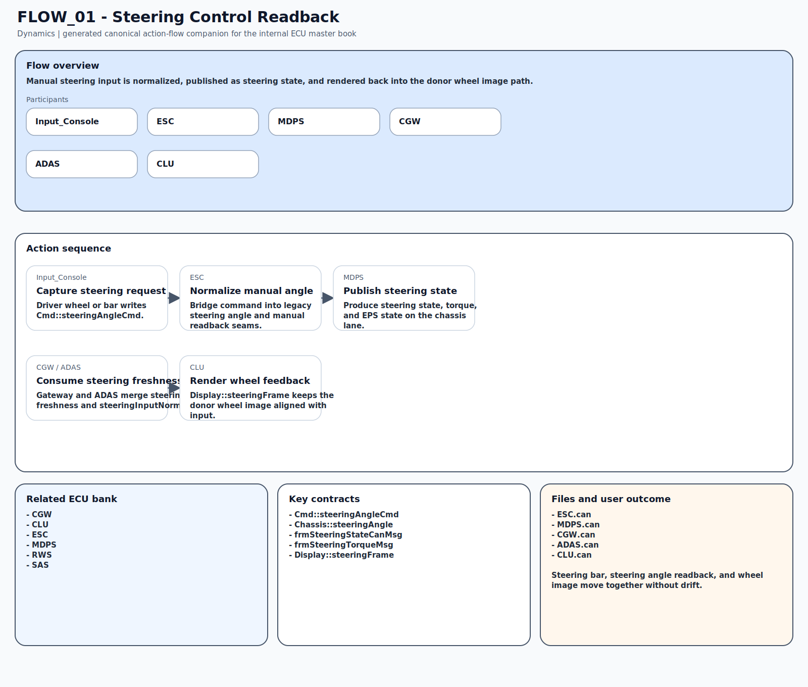

#### `FLOW_02` Brake Stability Response

Brake request, AEB pressure intent, and stability outputs are synchronized across chassis brake owners and downstream readers.

- User outcome: Brake intervention feels coordinated and the driver sees consistent brake and stability state feedback.
- Participant bank: `AEB / ADAS, ESC, ABS / EHB / VSM, VCU, CGW / CLU`
- Related ECU bank: `ABS, AEB, EHB, EPB, ESC, FCA, VCU, VSM`
- Key contracts: `frmAebDomainStateMsg, frmBrakeStatusMsg, frmBrakeTempMsg, frmWheelSpeedMsg, Chassis::brakePressure`

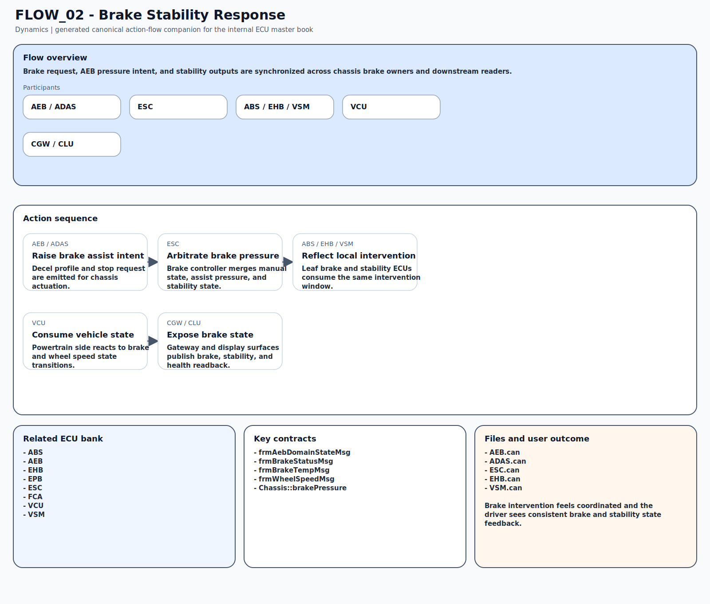

#### `FLOW_03` Propulsion Energy Status

Powertrain and energy ECUs consolidate drive, torque, battery, and charging state into the central propulsion state lane.

- User outcome: Vehicle mode, energy state, and propulsion readiness appear as one coherent status surface.
- Participant bank: `BAT_BMS / EMS, VCU, TCU / TRM, CGW / ADAS, CLU / IVI`
- Related ECU bank: `BAT_BMS, CPC, DCDC, EMS, EOP, EWP, FPCM, INVERTER, ISG, LVR, +5 more`
- Key contracts: `frmBatBmsStateMsg, frmVehicleStateCanMsg, frmPowertrainGatewayMsg, Chassis::vehicleSpeed, Chassis::driveState`

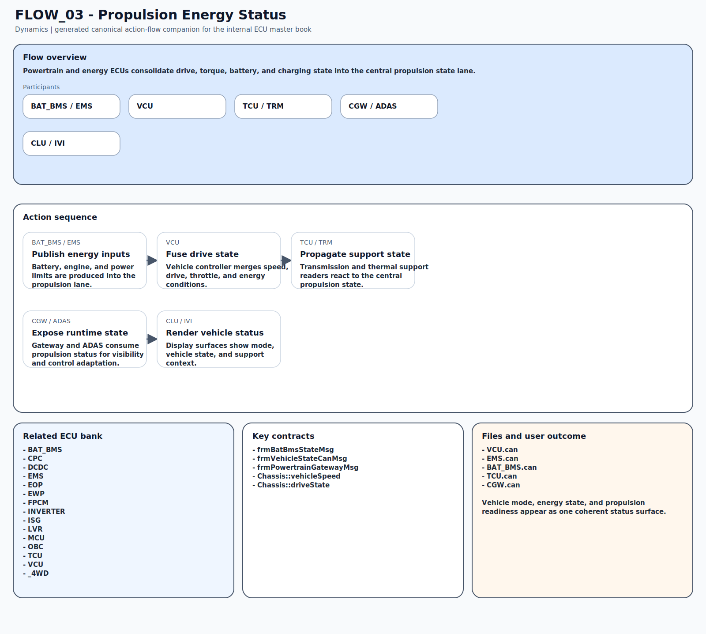

#### `FLOW_04` Cruise Speed Support

Cruise and longitudinal support state moves from support controllers into vehicle speed management and driver-facing outputs.

- User outcome: Cruise support state is readable, timely, and aligned between control and HMI.
- Participant bank: `SCC, VCU, ADAS, CGW, CLU / IVI`
- Related ECU bank: `EMS, SCC, TCU, VCU`
- Key contracts: `Powertrain::cruiseSetSpeed, frmCruiseStateMsg, frmVehicleStateCanMsg, selected support state`

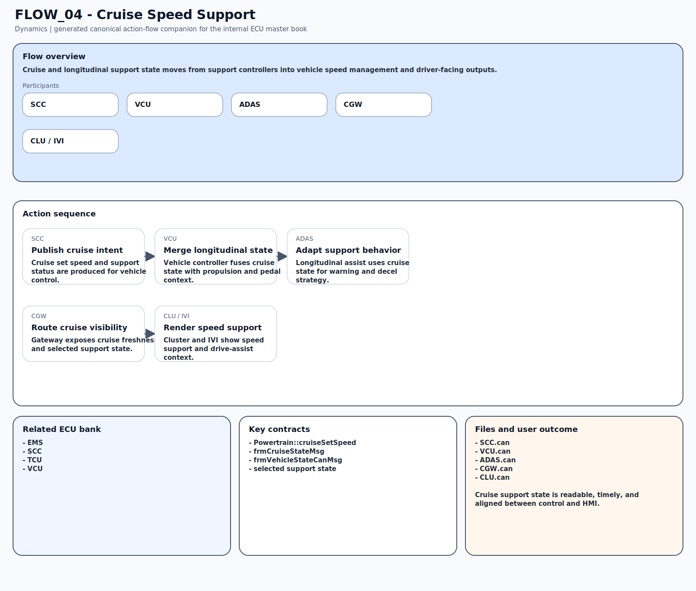

#### `FLOW_05` Chassis Sensor Health

Wheel, angle, suspension, and chassis leaf signals are collected so downstream control and visibility stay health-aware.

- User outcome: Chassis sensing and readiness stay visible and synchronized across control and display surfaces.
- Participant bank: `SAS / TPMS / RWS, ESC / MDPS, VCU / ADAS, CGW, CLU`
- Related ECU bank: `ABS, ACU, ASM, CDC, ECS, EHB, EPB, ESC, MDPS, ODS, +5 more`
- Key contracts: `frmSteeringAngleMsg, frmWheelSpeedMsg, frmTirePressureMsg, frmSuspensionStateMsg`

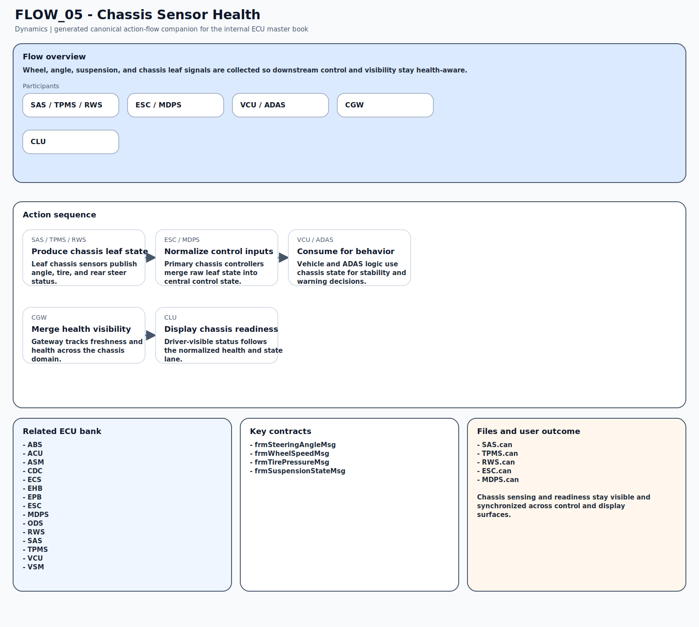

### ADAS

These flows show how sensing, fusion, and assist logic become one coherent intervention and warning chain.

#### `FLOW_06` Object Risk Fusion

Radar, camera, lidar, and perception nodes are fused into one object-risk lane for ADAS warning and assist decisions.

- User outcome: Object-risk interpretation is unified before any warning or assist output is shown to the driver.
- Participant bank: `FCAM / FRADAR / LDR, SRR_* / OMS, ADAS, CGW, CLU / IVI`
- Related ECU bank: `ADAS, AEB, AVM, BCW, DMS, FCA, FCAM, FRADAR, HWP, LCA, +16 more`
- Key contracts: `frmObjectRiskMsg, frmLaneStateMsg, frmAdasDomainStateMsg, selected alert level`

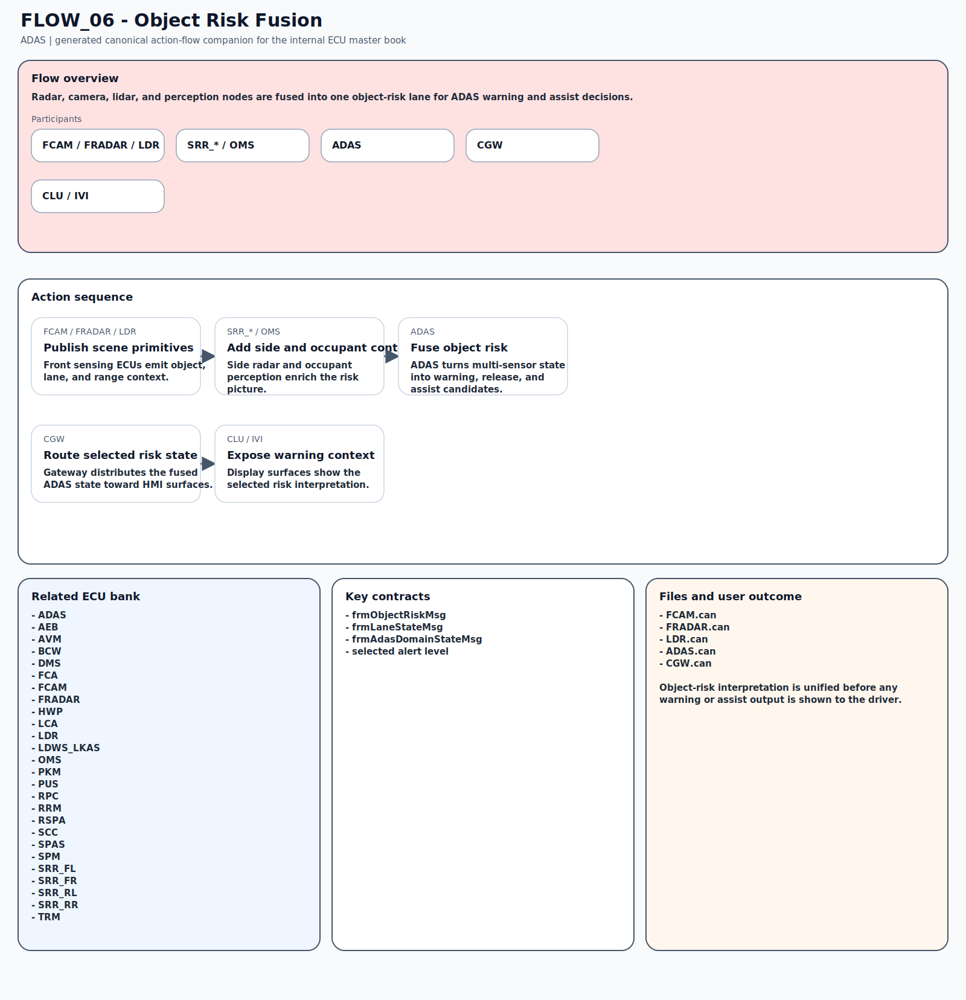

#### `FLOW_07` AEB Decel Intervention

AEB stop intent, decel profile, and downstream chassis response are connected as one intervention chain.

- User outcome: AEB behavior reads as one intervention story instead of separate ECU reactions.
- Participant bank: `FCA, AEB, ESC / EHB / VSM, VCU / SCC, CGW / CLU`
- Related ECU bank: `ADAS, AEB, EHB, ESC, FCA, SCC, VSM`
- Key contracts: `frmFcaStateMsg, frmAebDomainStateMsg, ethDecelAssistReqMsg, frmBrakeStatusMsg`

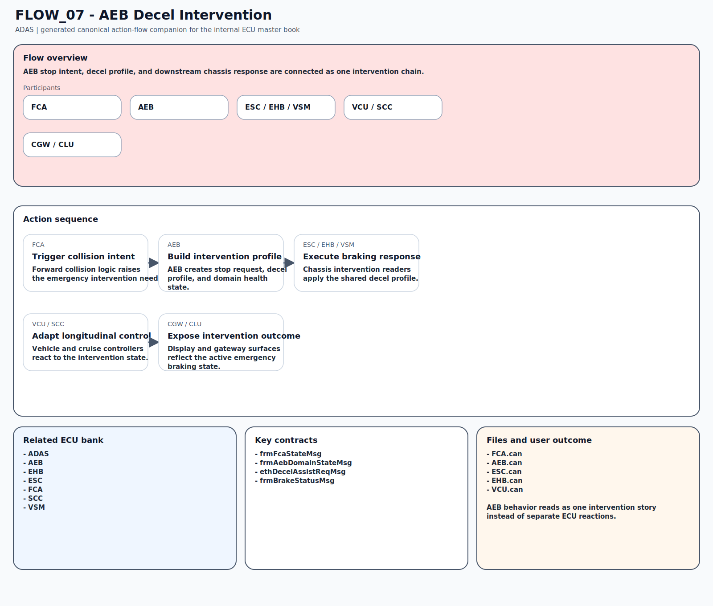

#### `FLOW_08` Lane and Surround Keeping

Lane keeping, blind-spot, and surround sensing work together to support steering and warning decisions.

- User outcome: Lane and surround warnings appear as one steering-side assistance behavior.
- Participant bank: `LDWS_LKAS / LCA / BCW, SRR_*, ADAS, MDPS, CLU / HUD`
- Related ECU bank: `ADAS, BCW, LCA, LDWS_LKAS, SRR_FL, SRR_FR, SRR_RL, SRR_RR`
- Key contracts: `frmLaneStateMsg, frmBlindSpotStateMsg, frmSteeringStateCanMsg, warning text code`

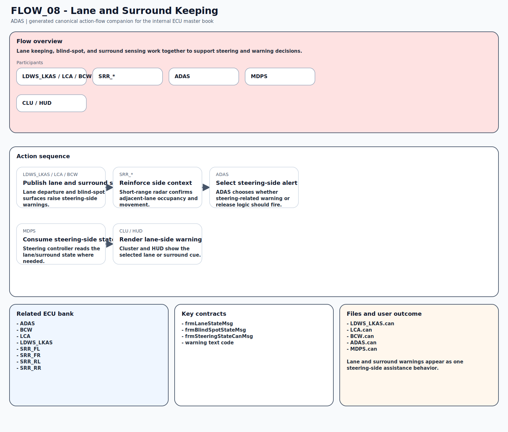

#### `FLOW_09` Parking and Surround Assist

Parking cameras, ultrasonic sensing, and parking controllers feed one parking-assist behavior chain.

- User outcome: Parking guidance and surround assistance feel like one guided maneuver story.
- Participant bank: `AVM / PUS, RPC / RRM / PKM, RSPA / SPAS / SPM, ADAS, IVI / CLU`
- Related ECU bank: `ADAS, AVM, PKM, PUS, RPC, RRM, RSPA, SPAS, SPM`
- Key contracts: `frmParkingStateMsg, frmUltrasonicStateMsg, frmCameraStateMsg, maneuver status`

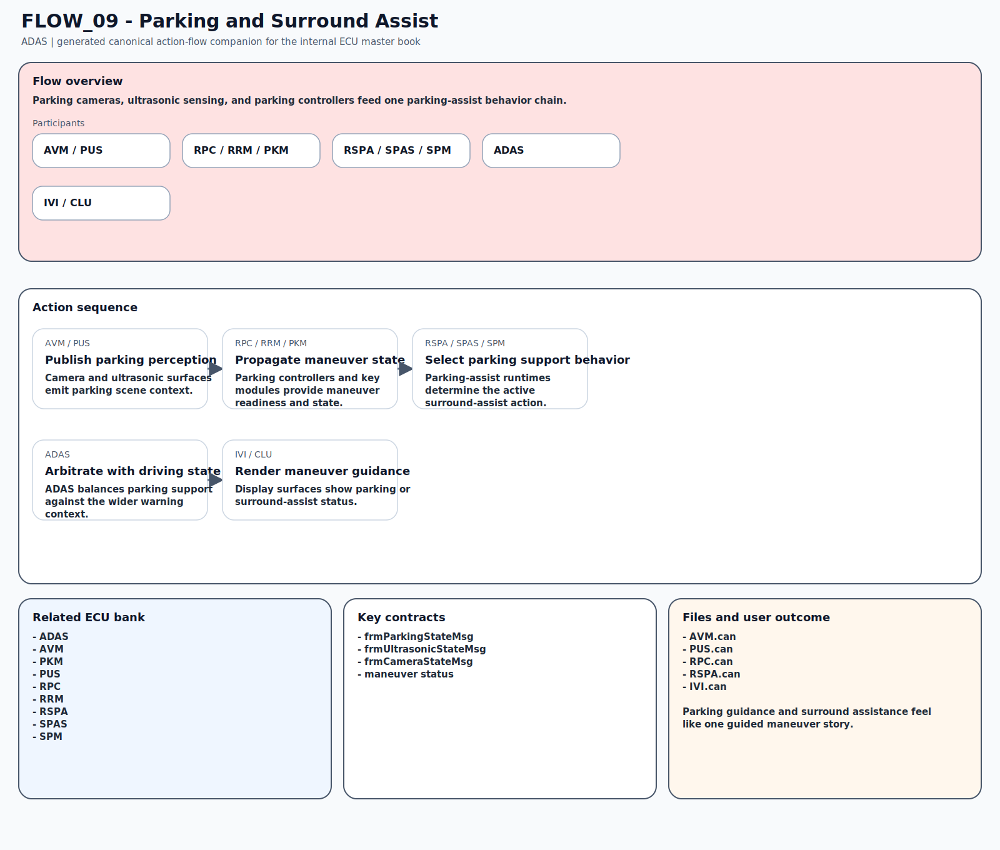

#### `FLOW_10` Driver Monitor and Occupant Risk

Driver state and occupant perception are fed into the warning lane before output arbitration happens.

- User outcome: Driver-state and occupant warnings are visible, audible, and consistent with the active context.
- Participant bank: `DMS / OMS, ADAS, CGW, CLU / IVI, AMP`
- Related ECU bank: `DMS, OMS`
- Key contracts: `frmDriverStateMsg, frmOccupantStateMsg, selected alert type, base volume`

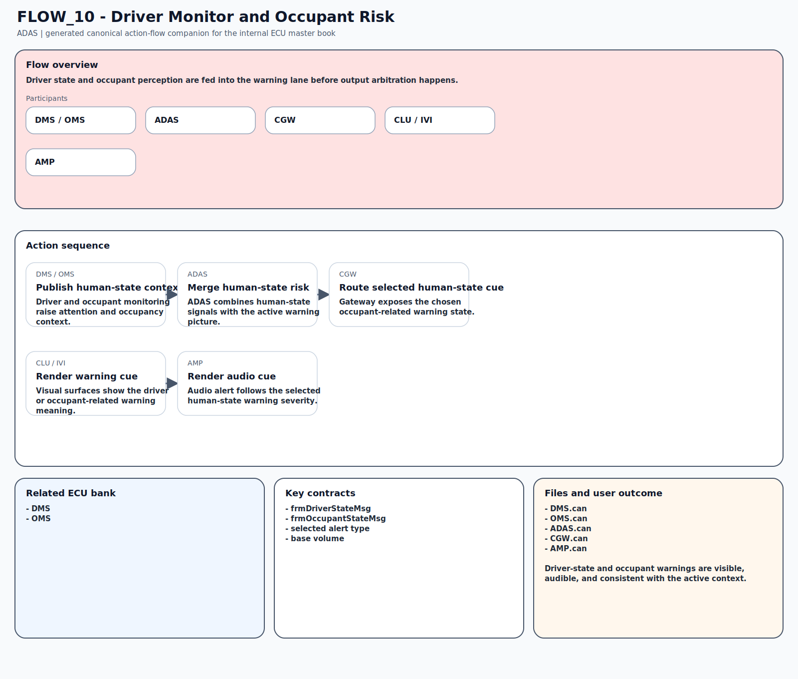

### Display and Alert

These flows turn selected alert state into cluster, HUD, audio, navigation, and service-facing user output.

#### `FLOW_11` Navigation Zone Context Ingress

Map and telematics context enters the runtime and becomes zone-aware alert context for downstream selection and HMI.

- User outcome: Zone-aware warning behavior is traceable from map context ingress to the final driver cue.
- Participant bank: `NAV / TMU, IVI, CGW, ADAS, CLU / AMP`
- Related ECU bank: `AMP, CLU, HUD, IVI, NAV, RSE, TMU, VCS`
- Key contracts: `frmNavContextCanMsg, frmNavModuleStateMsg, frmRoadZoneStateMsg, selected alert type`

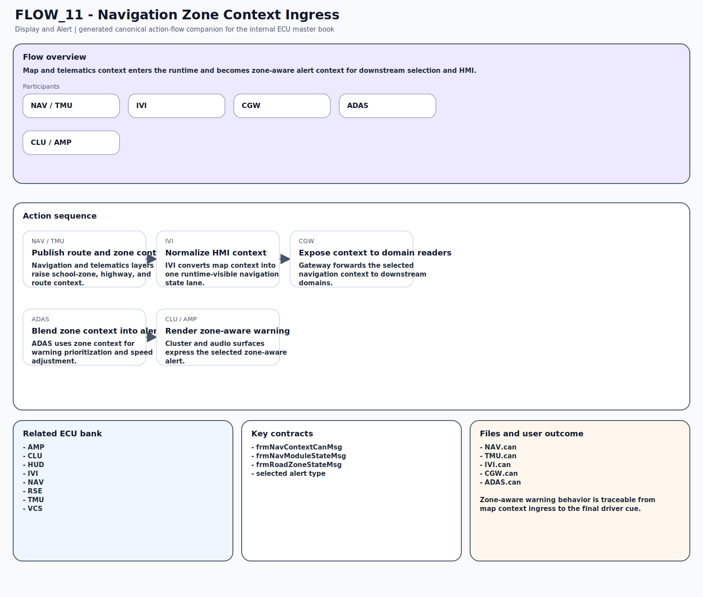

#### `FLOW_12` V2X Emergency Ingress

Emergency-vehicle ingress arrives through the V2X lane and is routed into the warning decision chain.

- User outcome: Emergency-vehicle alerts have a clear ingress point and an explainable output path.
- Participant bank: `V2X, CGW / ETHB, ADAS, IVI / CLU, AMP / HUD`
- Related ECU bank: `AMP, CGW, ETHB, HUD, V2X`
- Key contracts: `V2X::v2xFrame, ETH_EmergencyAlert, selected alert level, warning text code`

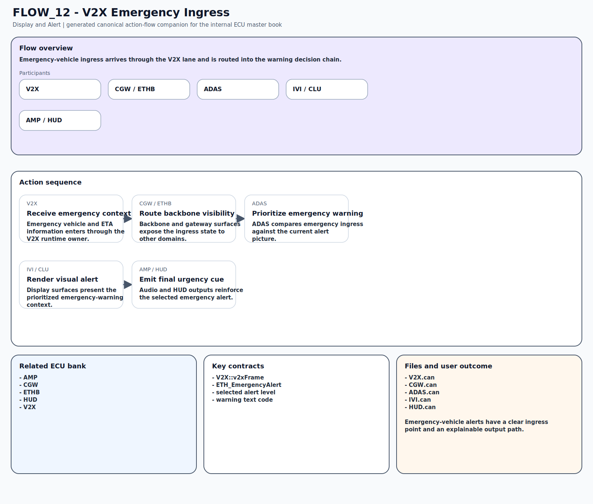

#### `FLOW_13` Alert Arbitration and Gate

Multiple warning candidates are reduced into one selected alert with explicit gateway and display semantics.

- User outcome: Only one alert meaning survives to the user-facing surfaces, and the gate reason remains explainable.
- Participant bank: `ADAS, CGW, IVI, CLU, AMP`
- Related ECU bank: `AMP, CGW, CLU, HUD, IVI, TMU, V2X, VCS`
- Key contracts: `Core::selectedAlertType, Core::selectedAlertLevel, CoreState::selectedAlertGateReason, Cluster::warningTextCode`

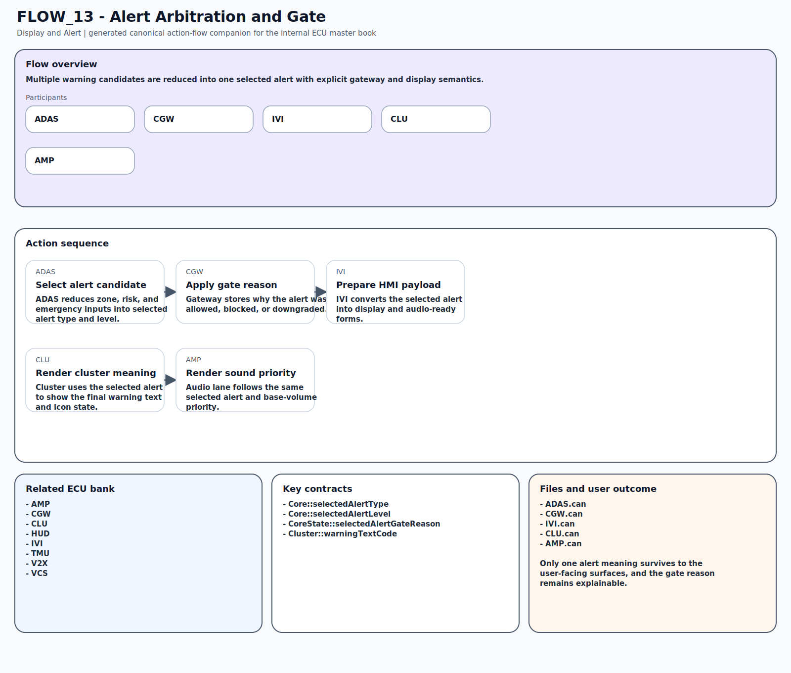

#### `FLOW_14` Cluster, HUD, and Audio Output

Selected warning state is rendered into cluster, HUD, and audio output without diverging message semantics.

- User outcome: Visual and audio warning channels stay aligned instead of competing with each other.
- Participant bank: `CGW / IVI, CLU, HUD, AMP, User`
- Related ECU bank: `AMP, CLU, HUD, IVI, TMU, VCS`
- Key contracts: `Cluster::warningTextCode, Display::steeringFrame, UiRender::renderVolumLevel, base volume`

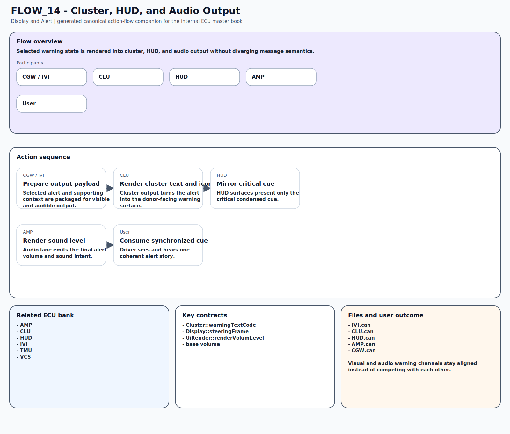

#### `FLOW_15` Service and Access HMI

Digital-key, payment, OTA, and related service surfaces are orchestrated through one HMI-facing service chain.

- User outcome: Service-facing screens read like one digital-access ecosystem, not isolated widgets.
- Participant bank: `DKEY / PAK / CPAY / OTA, IVI / TMU, IBOX / CGW, CLU / RSE / VCS, User`
- Related ECU bank: `CPAY, DKEY, IVI, NAV, OTA, PAK, PGS, RSE, TMU, VCS`
- Key contracts: `service state, key presence, payment context, OTA readiness`

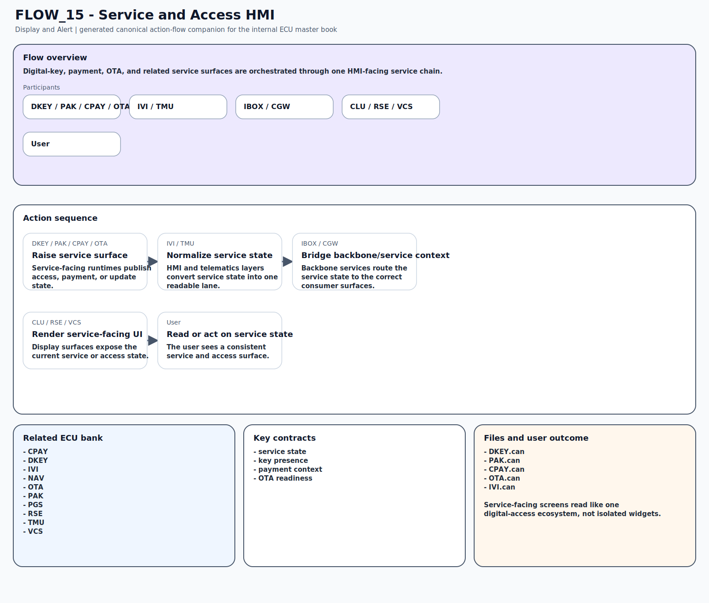

### Body and Comfort

These flows describe how body, comfort, and ambient actuators amplify or support the selected runtime state.

#### `FLOW_16` Body Ambient Warning Output

Body lighting, ambient, wiper, and exterior cues amplify the selected warning state in the comfort domain.

- User outcome: Ambient and body warning outputs reinforce the selected alert instead of acting independently.
- Participant bank: `CGW / BCM, AFLS / AHLS / HLM, WIP / MIR / SRF, IVI / CLU, User`
- Related ECU bank: `ADM, AFLS, AHLS, BCM, BIO, HLM, MIR, MSC, PTG, SRF, +2 more`
- Key contracts: `Body::ambientMode, Body::blinkLeft, Body::blinkRight, frontWiperAnimFrame`

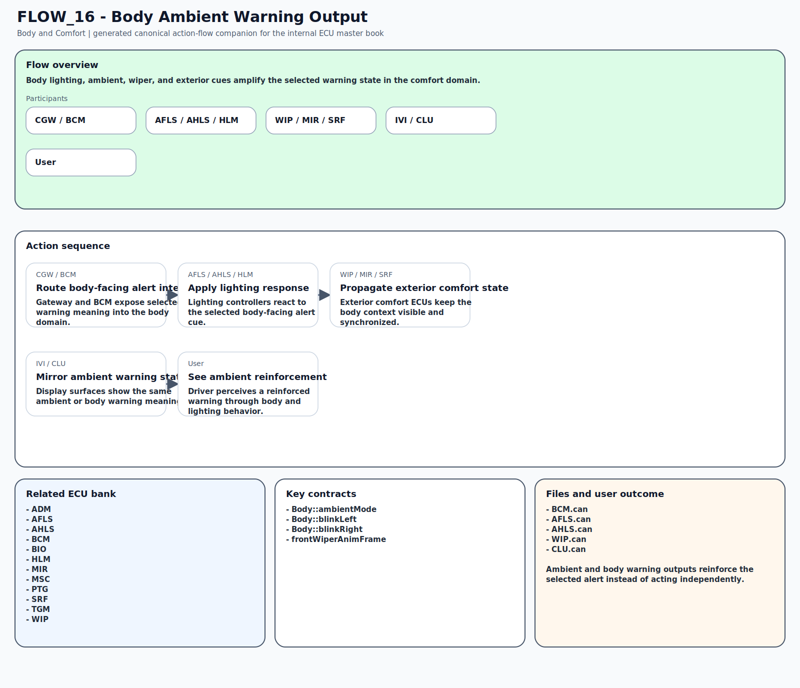

#### `FLOW_17` Access, Security, and Entry

Key, access, security, and door controllers are connected into one vehicle-entry behavior chain.

- User outcome: Entry, lock, and security behavior can be read as one access story from request to result.
- Participant bank: `DKEY / PAK / PGS, SMK / BSEC / CSM, DOOR_*, BCM, IVI / User`
- Related ECU bank: `BCM, BSEC, CSM, DKEY, DOOR_FL, DOOR_FR, DOOR_RL, DOOR_RR, PAK, PGS, +1 more`
- Key contracts: `key presence, door lock state, entry authorization, body security state`

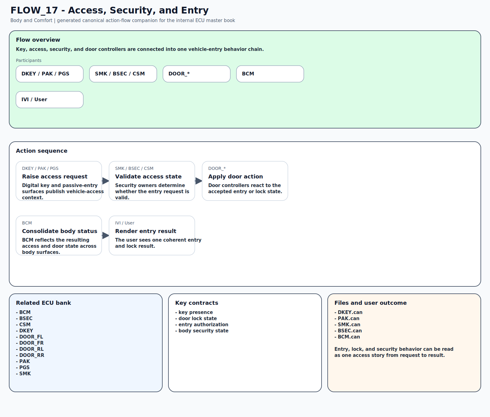

#### `FLOW_18` Comfort, Climate, and Seat

Climate and seat controllers are orchestrated as one comfort-domain runtime surface with body and HMI visibility.

- User outcome: Comfort-domain status is discoverable without hunting across separate climate and seat surfaces.
- Participant bank: `DATC / RATC, SEAT_DRV / SEAT_PASS, BCM, IVI / CLU, User`
- Related ECU bank: `BCM, DATC, RATC, SEAT_DRV, SEAT_PASS`
- Key contracts: `climate state, seat state, comfort visibility, body comfort mode`

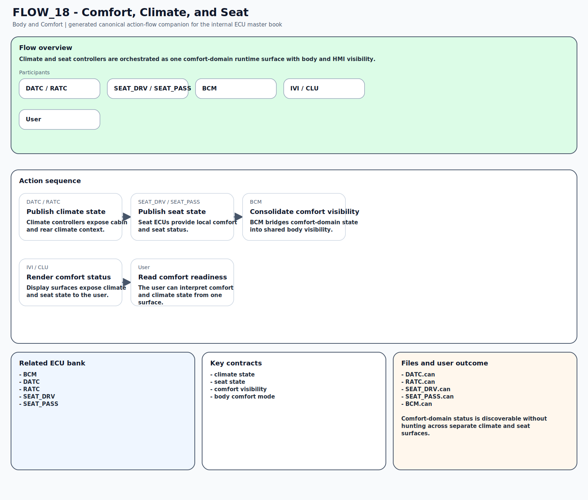

### Validation

These flows keep scenario control and verdict readback inside a dedicated validation lane.

#### `FLOW_19` Validation Scenario Control

Scenario command, injected state, and verdict readback are kept inside a dedicated validation control story.

- User outcome: Validation control remains an explicit harness story instead of leaking into product ownership.
- Participant bank: `TEST_SCN, feature owners, CGW / IVI / CLU, TEST_BAS, Engineer`
- Related ECU bank: `TEST_BAS, TEST_SCN`
- Key contracts: `Test::scenarioCommand, Test::scenarioActiveId, Test::scenarioResult, validation summary seams`

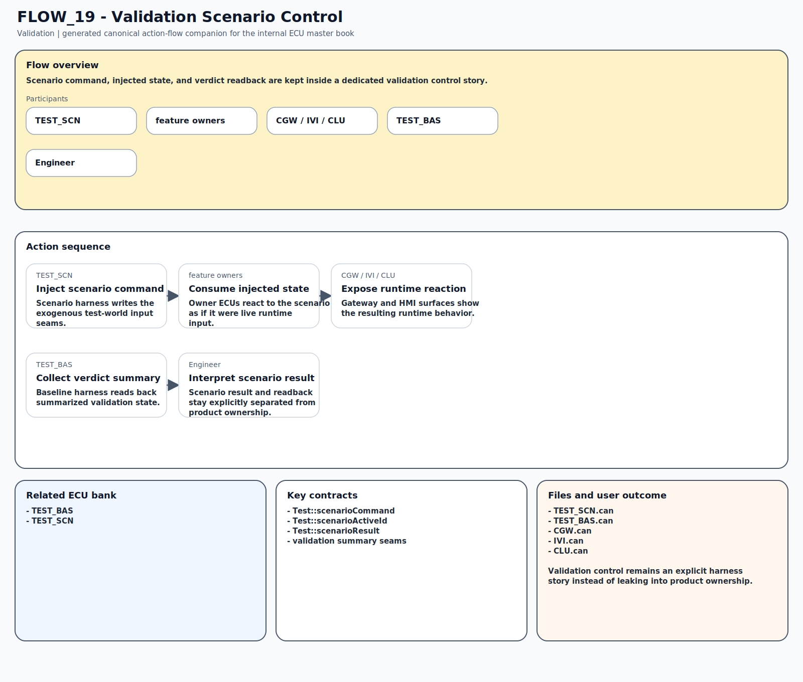

### Backbone

These flows describe how gateway, diagnostics, and Ethernet-facing services route state across domains.

#### `FLOW_20` Backbone, Diagnostic, and Service Routing

Gateway, backbone, diagnostics, and service-facing surfaces route runtime state without becoming hidden feature owners.

- User outcome: Backbone and diagnostic behavior is readable as one routing story instead of scattered support nodes.
- Participant bank: `ETHB / IBOX, CGW / SGW, DCM / EXT_DIAG / EDR, IVI / service surfaces, Engineer / tool`
- Related ECU bank: `CGW, DCM, EDR, ETHB, EXT_DIAG, IBOX, SGW, TEST_BAS, TEST_SCN, V2X`
- Key contracts: `diagnostic request, diagnostic response, gateway state, service routing state`

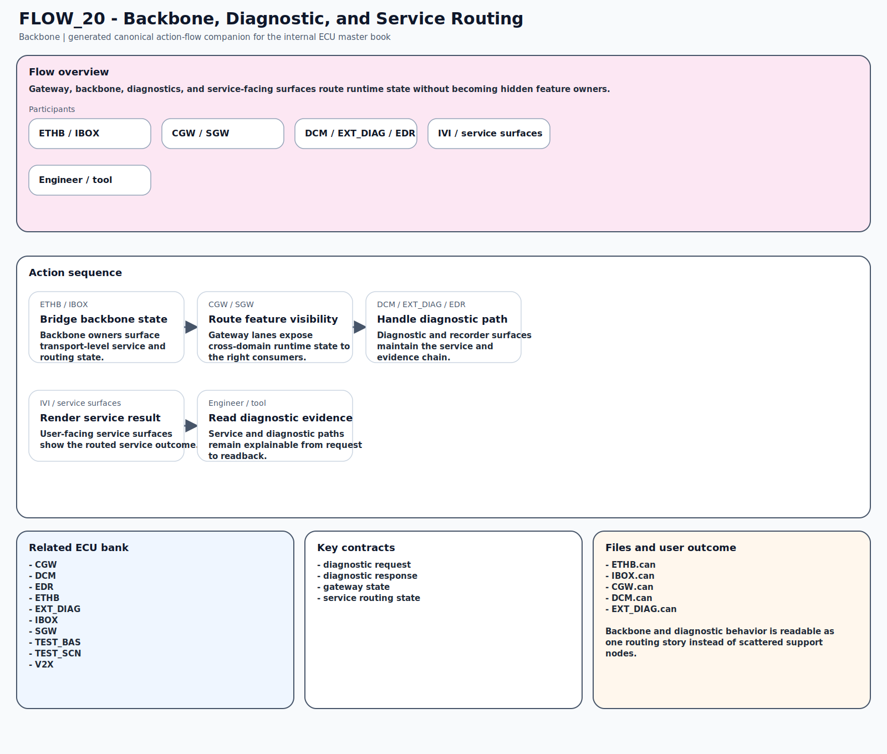

## ECU Catalog

The catalog below is grouped by architecture group so the book reads as one system story instead of a flat asset list.
Each ECU section keeps one human-readable sentence, one concise metadata table, and the two SVG pages.

## Group 01 Base Vehicle Dynamics

The base vehicle dynamics group consolidates steering, braking, propulsion, and chassis health into one controllable runtime lane.

- Group size: `29` ECU
- Native test anchor count: `12`
- Domain spread: `Chassis 15, Powertrain 14`

### `ABS`

Publishes anti-lock brake state and brake intervention feedback for chassis and ADAS consumers

### `ACU`

Publishes crash and restraint state so gateway, body, and warning surfaces can react to occupant-safety events

### `ASM`

Publishes air-suspension state so chassis and ADAS readers can adapt ride and stability behavior

### `CDC`

Publishes damping-control state and diagnostics for chassis health and adaptation readers

### `ECS`

Publishes electronic suspension state for chassis health and downstream ride-control consumers

### `EHB`

Coupled consumer of AEB state rather than an independent decision origin

### `EPB`

Publishes parking-brake state and diagnostics for cluster and validation readers

### `ESC`

Consumes vehicle and AEB state, then publishes brake and stability state to downstream readers

### `MDPS`

Steering state must stay aligned across manual command, owner readback, and display frame

### `ODS`

Publishes occupant-detection state for body and gateway safety decisions

### `RWS`

Publishes rear-wheel steering state so steering and stability consumers stay aligned

### `SAS`

Publishes steering-angle sensor state for steering control, stability logic, and validation visibility

### `TPMS`

Publishes tire-pressure and wheel-health state for chassis visibility and warning surfaces

### `VCU`

Primary dynamics producer for speed, drive state, and throttle interpretation

### `VSM`

Consumes ESC and AEB domain state to produce local stability intervention behavior

### `BAT_BMS`

Publishes battery and energy state so propulsion, charging, and display surfaces share one EV health view

### `CPC`

Publishes central propulsion coordination state for downstream powertrain readers

### `DCDC`

Publishes DC-DC converter state for energy distribution and charging-health visibility

### `EMS`

Publishes engine and propulsion health state for vehicle control and display readers

### `EOP`

Publishes oil-pump state for propulsion support and thermal-health visibility

### `EWP`

Publishes electric water-pump state for thermal support and propulsion-health readers

### `FPCM`

Publishes fuel-pump control state for propulsion support and diagnostic visibility

### `INVERTER`

Publishes inverter state and power-conversion feedback for propulsion-control consumers

### `ISG`

Publishes starter-generator state for propulsion readiness and energy coordination

### `LVR`

Publishes lever or range-selection state for drive-mode and propulsion coordination

### `MCU`

Publishes motor-control state for torque delivery and EV propulsion coordination

### `OBC`

Publishes on-board charger state for charging status and energy visibility

### `TCU`

Publishes transmission state for longitudinal control and driver-facing vehicle status

### `_4WD`

Publishes four-wheel-drive engagement state for propulsion coordination and chassis awareness

## Group 02 ADAS AEB Brake Assist

The ADAS group collects perception, collision risk, parking assist, and intervention logic into one behavior-decision layer.

- Group size: `26` ECU
- Native test anchor count: `10`
- Domain spread: `ADAS 26`

### `ADAS`

Consumes route, chassis, and emergency context, then emits selected alert and assist intent

### `AEB`

One AEB profile change can appear as multiple simultaneous chassis ECU reactions

### `AVM`

Publishes around-view monitor state for parking and display consumers

### `BCW`

Publishes blind-spot warning state for alert selection and driver warning output

### `DMS`

Publishes driver monitoring state so assist and warning logic can react to attention loss

### `FCA`

Publishes forward-collision assist state and request feedback for braking and warning consumers

### `FCAM`

Publishes forward-camera perception state for object-risk and highway-ready decisions

### `FRADAR`

Publishes front-radar perception state for object fusion and assist decisions

### `HWP`

Publishes highway-pilot readiness and state for driver-monitor, cluster, and assist consumers

### `LCA`

Publishes lane-change assist state for warning and driver-guidance outputs

### `LDR`

Publishes lidar perception state for object fusion and path-readiness consumers

### `LDWS_LKAS`

Publishes lane-departure and lane-keeping state for warning and steering-support consumers

### `OMS`

Publishes occupant-monitoring state for body safety and alert decisions

### `PKM`

Publishes parking-master state for parking-assist orchestration and HMI visibility

### `PUS`

Publishes parking-ultrasonic state for parking assist and body or IVI readers

### `RPC`

Publishes road-preview camera state for ADAS control-adaptation readers

### `RRM`

Publishes rear-radar master state for surround awareness and warning selection

### `RSPA`

Publishes remote smart parking-assist state for chassis, assist, and display consumers

### `SCC`

SCC support behavior feeds ADAS and VCU rather than directly owning output HMI

### `SPAS`

Publishes smart parking-assist state for steering-support and parking HMI consumers

### `SPM`

Publishes surround parking-master state for parking coordination and HMI output

### `SRR_FL`

Publishes front-left corner radar state for surround fusion and parking or lane-assist consumers

### `SRR_FR`

Publishes front-right corner radar state for surround fusion and parking or lane-assist consumers

### `SRR_RL`

Publishes rear-left corner radar state for surround fusion and parking or lane-assist consumers

### `SRR_RR`

Publishes rear-right corner radar state for surround fusion and parking or lane-assist consumers

### `TRM`

Publishes trailer-management state for ADAS and vehicle-state consumers

## Group 03 Display Warning Audio

The display and alert group turns selected warning state into visible, audible, and service-facing user output.

- Group size: `13` ECU
- Native test anchor count: `7`
- Domain spread: `Infotainment 13`

### `AMP`

Receives gated audio intent from IVI/BCM and renders the final alert volume

### `CLU`

Consumes selected alert state and vehicle state to build cluster-facing output

### `CPAY`

Publishes connected payment service state for IVI and service-surface readers

### `DKEY`

Publishes digital-key service state for IVI and access-service consumers

### `HUD`

Renders selected warning and driver-guidance state into the head-up display surface

### `IVI`

Routes gated alert state into visible display, map, and audio focus paths

### `NAV`

Publishes navigation context and route state for zone-aware warning and assist consumers

### `OTA`

Publishes over-the-air service state for IVI and backbone service visibility

### `PAK`

Publishes passive-access key state for service and access consumers

### `PGS`

Publishes parking-guidance system state for IVI and parking HMI readers

### `RSE`

Publishes rear-seat entertainment state for infotainment service visibility

### `TMU`

Publishes telematics and remote-service state for IVI, climate, and navigation consumers

### `VCS`

Publishes voice and connected-speech state for audio and IVI service consumers

## Group 04 Body Comfort Ambient

The body and comfort group amplifies warning context through lighting, entry, ambient, climate, and comfort-domain state.

- Group size: `23` ECU
- Native test anchor count: `12`
- Domain spread: `Body 23`

### `ADM`

Publishes automatic door control state for body comfort and access surfaces

### `AFLS`

Publishes adaptive front-lighting state for body lighting and driver-visibility consumers

### `AHLS`

Publishes automatic high-beam lighting state for body lighting and visibility surfaces

### `BCM`

Owns comfort and ambient outputs while bridging body leaf ECU state back to HMI

### `BIO`

Publishes biometric authentication state for access and security consumers

### `BSEC`

Publishes body security and alarm state for access, warning, and service visibility

### `CSM`

Publishes cabin sensing state for access, security, and comfort decisions

### `DATC`

Publishes HVAC and climate-control state for comfort-domain and telematics readers

### `DOOR_FL`

Publishes front-left door state for access, security, and comfort visibility

### `DOOR_FR`

Publishes front-right door state for access, security, and comfort visibility

### `DOOR_RL`

Publishes rear-left door state for access, security, and comfort visibility

### `DOOR_RR`

Publishes rear-right door state for access, security, and comfort visibility

### `HLM`

Publishes headlamp-leveling state for lighting visibility and body diagnostics

### `MIR`

Publishes mirror state for body comfort and driver-visibility surfaces

### `MSC`

Publishes massage-seat control state for seat comfort and HMI visibility

### `PTG`

Publishes power-tailgate state for access and body comfort visibility

### `RATC`

Publishes rear-climate state for rear-cabin comfort and HMI readers

### `SEAT_DRV`

Publishes driver-seat state for comfort control and HMI visibility

### `SEAT_PASS`

Publishes passenger-seat state for comfort control and HMI visibility

### `SMK`

Publishes smart-key and immobilizer state for access security and validation readers

### `SRF`

Publishes sunroof state for comfort control and body visibility

### `TGM`

Publishes tailgate state for body access and comfort visibility

### `WIP`

Publishes wiper state and diagnostics for body visibility and warning surfaces

## Group 05 Validation Scenario

The validation group isolates scenario injection and verdict readback so test orchestration stays separate from normal feature ownership.

- Group size: `2` ECU
- Native test anchor count: `0`
- Domain spread: `ETH_Backbone 2`

### `TEST_BAS`

Receives internal input router helpers and publishes baseline validation summaries

### `TEST_SCN`

Scenario entry point for validation presets, stop/manual logic, and scenario verdict readback

## Group 06 Backbone Gateway Diagnostics

The backbone and diagnostics group routes runtime state, service traffic, and external interfaces without becoming a hidden feature owner.

- Group size: `8` ECU
- Native test anchor count: `6`
- Domain spread: `ETH_Backbone 8`

### `CGW`

Bridges domain outputs toward IVI, CLU, BCM, and AMP while enforcing gate logic

### `DCM`

Publishes diagnostic manager state for service routing and diagnostic visibility

### `EDR`

Publishes event-data recorder state for fail-safe logging and service readers

### `ETHB`

Publishes Ethernet backbone state for service routing and link-health visibility

### `EXT_DIAG`

Publishes external diagnostic session state for service routing and workshop ingress

### `IBOX`

Publishes in-vehicle connectivity hub state for service-link visibility

### `SGW`

Publishes secure-gateway state for service routing and access-control visibility

### `V2X`

Owns emergency ingress context before ADAS and CGW perform prioritization

## Evidence Watchlist

- No direct native test anchor yet: `ABS, ASM, ESC, MDPS, RWS, SAS, TPMS, VCU, BAT_BMS, CPC, EOP, EWP, FPCM, ISG, LVR, TCU, _4WD, AEB, +36 more`
- No published contract rows: `TEST_BAS, CGW, DCM, EDR, ETHB, EXT_DIAG, IBOX, SGW, V2X`
- No consumed contract rows: `ASM, RWS, CPC, EOP, EWP, FPCM, INVERTER, ISG, LVR, MCU, _4WD, AVM, +25 more`
- Canonical action-flow count: `20`

