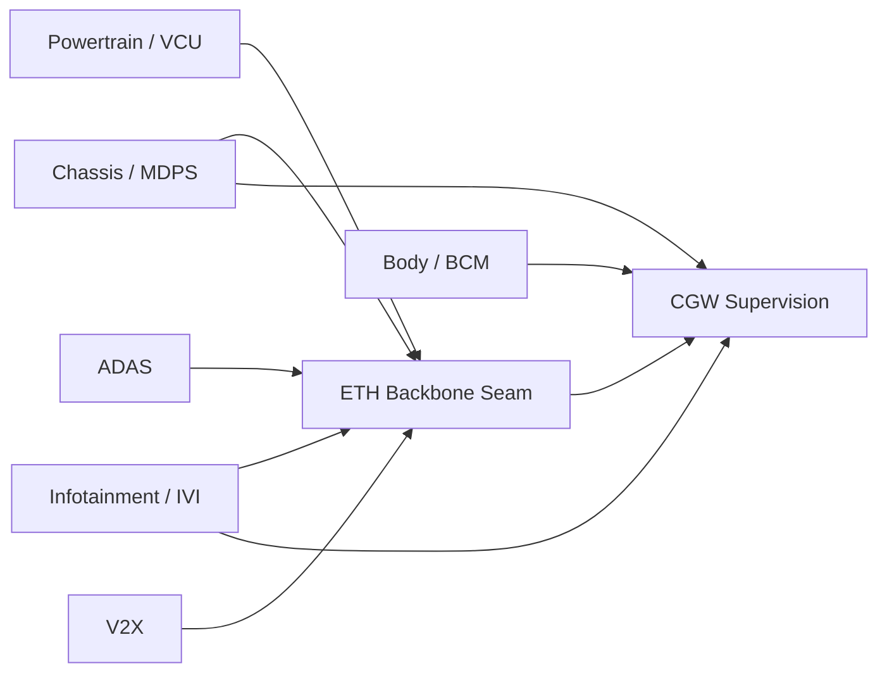
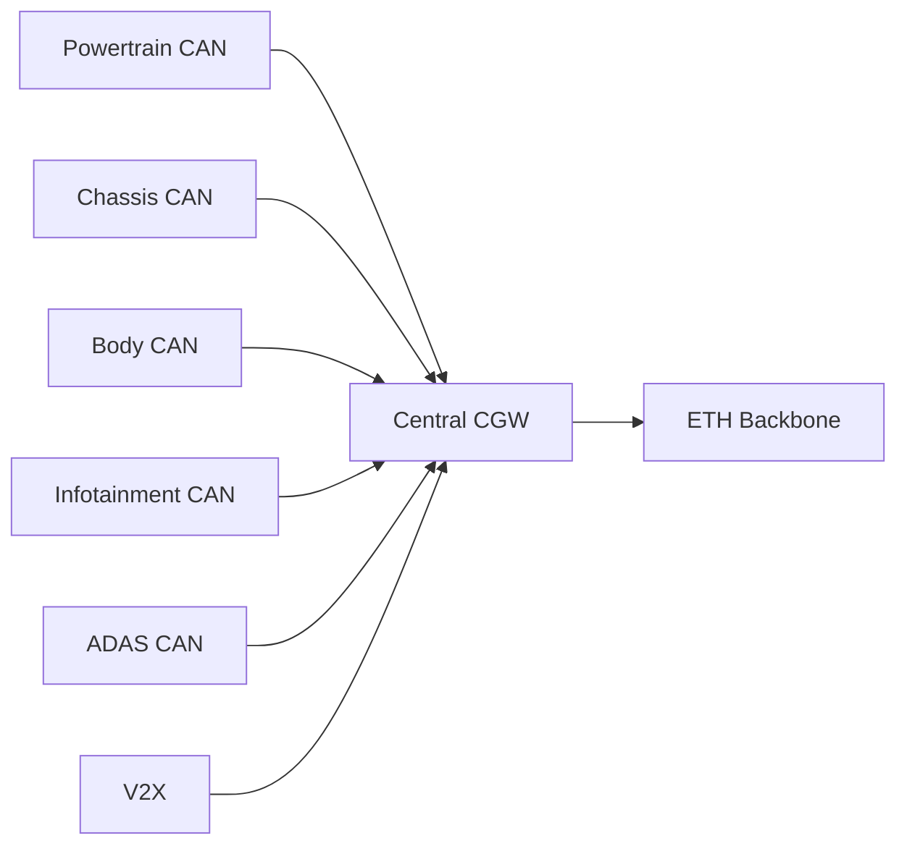

# Domain Controller vs Central CGW View (2026-03-10)

## Short Answer

Current code is closer to `domain-controller style + CGW supervision`, not a pure `everything-through-CGW` topology.

## What The User Assumed

User assumption:
- each domain CAN is gathered by a central CGW
- CGW relays all cross-domain payload into backbone/Ethernet
- downstream domains receive cross-domain data back from CGW

That is a valid architecture pattern, but it is not the current code baseline.

## What Current Code Actually Does

Current code pattern:
- key surface ECUs publish seam data directly
- `CGW` supervises boundary/fail-safe/health
- `CGW` does not relay every raw domain payload

Examples in current code:
- `VCU` publishes vehicle state seam
- `IVI` publishes navigation context seam
- `MDPS` publishes steering seam
- `V2X` publishes emergency monitor seam
- `CGW` consumes summarized seam/health signals and decides boundary/fail-safe state

## Current View

## Centralized CGW View

## Why The Difference Matters

If the team wants centralized-CGW architecture:
- seam publication must move out of `VCU`/`IVI`/`MDPS`/`ADAS`/`V2X`
- `CGW` must become the main cross-domain publisher
- current runtime ownership must change

If the team keeps current architecture:
- current code remains valid
- the structure should be documented as domain-controller style
- confusion should be removed by better classification, not by pretending CGW relays everything

## Decision Use

Use this file to compare:
1. current runtime fact
2. desired OEM narrative
3. whether future refactoring should move toward centralized gateway or keep domain-controller style
