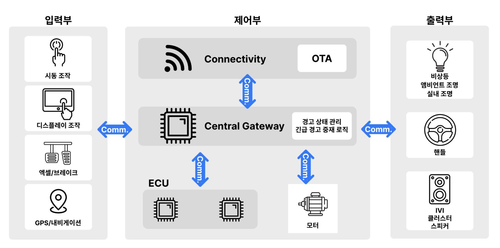
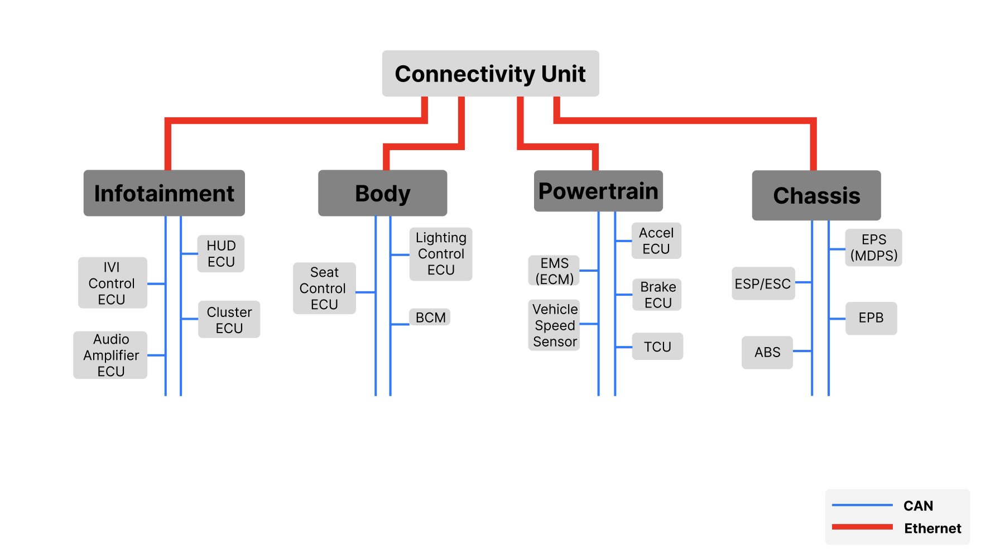

# 컨셉 디자인 (Concept Design)

**Document ID**: PROJ-02-CD  
**Version**: 2.6  
**Date**: 2026-03-05  
**Status**: In Progress (Figure Build)  
**Project Title**: 주행 상황 실시간 경고 시스템  
**Subtitle**: 구간 정보 및 긴급차량 접근 기반 앰비언트·클러스터 경보

---

## 1. 문서 목적

본 문서는 00~07 문서 체인 중 **시각 설계 증거(Architecture Visualization)**를 담당한다.  
현재는 그림 제작 전 단계로, 최종 반영 시 본문은 최소 설명만 남기고 대부분을 그림으로 대체한다.

---

## 2. 기준 아키텍처 (고정)

- 채택안: **Option 1**
- 구조: `ETH_SW + Domain Gateway + Domain CAN + 중앙 경고코어`
- 범위: CANoe SIL, CAN + Ethernet(UDP)
- 핵심 규칙:
  - `Emergency > Zone`
  - `Ambulance > Police`
  - 동률 시 `ETA 오름차순 -> SourceID 오름차순`
  - Timeout Clear: `1000ms`

---

## 3. 그림 구성 계획 (02 본문 대체 대상)

| 문서 그림 번호 | 그림명 | 핵심 내용 | 연계 문서 |
|---|---|---|---|
| 02-01 | 전체 아키텍처 블록도 | VAL_SCENARIO_CTRL -> GW -> ETH_SW -> 중앙 경고코어 -> 출력 도메인 | 03, 0301, 0302 |
| 02-02 | 도메인/버스 분리도 | Chassis CAN / Infotainment CAN / Ethernet UDP 경계 | 0302, 0303 |
| 02-03 | 시나리오 체인도 | 스쿨존 과속 / 고속도로 무조향 / 긴급 접근-해제 | 0301, 05, 06, 07 |
| 02-04 | 중재/상태 전이도 | 경고 충돌 중재, 우선순위, 해제/복귀 | 0301, 04 |
| 02-05 | 추적성 연결도 | Req -> Func -> Flow -> Comm -> Var 경로 가시화 | 01, 0301~0304 |

---

## 4. 그림 캡션 초안 (삽입용)

### Figure 02-01. Option 1 시스템 아키텍처
- 입력: `VAL_SCENARIO_CTRL`
- 게이트웨이: `CHS_GW`, `INFOTAINMENT_GW`
- 중앙 코어: `ADAS_WARN_CTRL`, `NAV_CTX_MGR`, `EMS_ALERT`, `WARN_ARB_MGR`
- 출력: `BODY_GW -> AMBIENT_CTRL`, `IVI_GW -> CLU_HMI_CTRL`

### Figure 02-02. 도메인 네트워크 분리
- Chassis CAN: 차량 상태/조향 입력
- Infotainment CAN: 내비 문맥(roadZone/navDirection/zoneDistance/speedLimit)/클러스터 경고
- Ethernet UDP: 긴급 알림(E100), 중재 결과(E200)

### Figure 02-03. 핵심 시나리오 체인
- 스쿨존 과속
- 고속도로 무조향
- 경찰/구급 긴급 접근 + 1000ms 타임아웃 해제

### Figure 02-04. 경고 중재 상태도
- Normal -> Zone Warning -> Emergency Warning
- 충돌 시 중재 규칙 적용
- Clear/Timeout 시 이전 문맥 복귀

### Figure 02-05. 추적성 브리지
- `Req_xxx -> Func_xxx -> Flow_xxx -> Comm_xxx -> Var_xxx`
- 05/06/07 테스트 ID 역방향 연결 표시

---

## 5. 최종 변환 규칙 (그림 반영 시)

- 본문은 본 섹션 1, 2, 5만 남기고 3, 4는 그림+짧은 캡션으로 대체한다.
- 노드명/ID 표기는 0301~0304와 완전히 동일하게 유지한다.
- 구현 코드/세부 알고리즘은 02에 작성하지 않는다. (04에 유지)

---

## 개정 이력

| 버전 | 날짜 | 변경 사항 |
|---|---|---|
| 2.6 | 2026-03-05 | Validation Harness 노드 명칭을 `VAL_SCENARIO_CTRL` 기준으로 정리해 03/0301/0302 용어와 정합화. |
| 2.5 | 2026-03-01 | 상위 컨셉 캡션의 EMS 표기를 논리 단말(`EMS_ALERT`) 기준으로 통일. 내부 TX/RX 모듈은 03계열 하단 보강표에서 분리 관리. |
| 2.0 | 2026-02-25 | 주행상황 연동 실시간 경고 시스템 기준으로 컨셉 재정의 |
| 2.1 | 2026-02-26 | 아키텍처 대안(Option 1/1A/2/3) 비교 및 채택 결론 추가 |
| 2.2 | 2026-02-26 | 컨셉 블록도/네트워크 섹션에 도메인 GW 실명 반영 |
| 2.4 | 2026-02-28 | 네트워크 분리 캡션에 `speedLimit` 입력을 반영해 0302/0303/0304과 정합화. |
| 2.3 | 2026-02-27 | 02 문서를 그림 중심 구조로 전환하기 위한 시각화 계획/캡션/변환 규칙 추가 |
