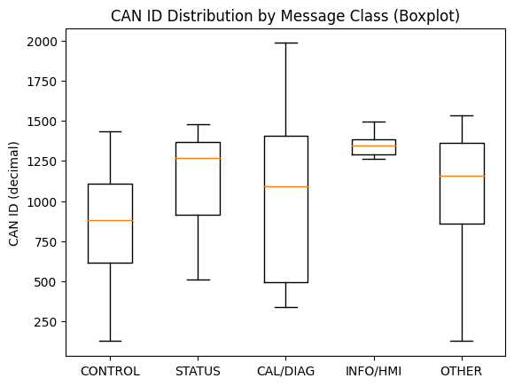

# 분석 방향

현대차 및 기타 OEM에서 공식적으로 제공한 문서는 찾을 수 없었음. 그래서 opendbc파일로부터 역으로 추측하는 방법을 사용함.

# `hyundai_kia_generic.dbc` 파일 기반 분석

## Q. ECU의 종류에 따라 우선순위가 나눠지나?

- 메시지 수: **146**
- ECU(송신 노드) 수: **44**
- 그중 메시지를 2개 이상 송신하는 ECU: **21** (나머지 23개는 1개만 송신)
- ECU 쌍($44 \mathrm{C} 2 = 946$) 중
    - 한쪽 ECU가 다른쪽 ECU보다 “항상” 우선(모든 메시지 ID가 더 작음)인 **완전 우위 쌍**: **599쌍**
    - **서로 섞이는(interleaving) 쌍**(A의 어떤 메시지는 B보다 우선하지만, A의 다른 메시지는 B보다 후순위인 경우): **347쌍**

즉, **약 36.7% ECU 쌍에서 interleaving이 발생**합니다

<aside>
✅

이런 경우 “정책”은 **ECU 단위가 아니라 메시지 클래스 단위** (Safety/Control/Status/Diag/Cal/Infotainment 등)로 보는 게 맞습니다.

</aside>

---

## Q. 메세지 ID는 다닥다닥 붙어있나?

- **요청(Request)**, **토크/브레이크/조향** 같은 “제어” 메시지는 낮은 ID
- *상태(Status)**는 중간
- *진단/캘리브레이션/툴링(CAL, Diag, Debug)**은 높은 ID
- **0x000–0x0FF:** 메시지 10개, ECU 5개
- **0x100–0x1FF:** 메시지 12개, ECU 7개
- **0x200–0x2FF:** 메시지 7개, ECU 4개
- **0x300–0x3FF:** 메시지 28개, ECU 17개
- **0x400–0x4FF:** 메시지 23개, ECU 14개
- **0x500–0x5FF:** 메시지 65개, ECU 28개
- **0x700–0x7FF:** 메시지 1개, ECU 1개 (0x7C0)

<aside>
✅

이 분포만 봐도, 이 파일은 “낮은 ID는 소수, 0x500대에 메시지/ECU가 대거 몰림” 구조입니다. 즉 **ID로 도메인/정책을 구간화해서 해석**하는 게 유효합니다.

</aside>

---

## Q. 도메인별 메세지 ID 분포는?

### 눈에 띄는 점

- **STATUS / INFO/HMI**가 상대적으로 **높은 ID(대략 1200~1500 근처)**에 더 자주 분포
- **CONTROL**은 **낮은 ID도 존재**하고(좌측 꼬리), 동시에 중간/높은 ID에도 섞여 있어 “제어 메시지가 항상 최저 ID만 쓰는 건 아님”이 보입니다.
- **CAL/DIAG**는 표본이 적지만, **매우 높은 ID(2000 근처)**가 튀는 케이스가 있어 “서비스/보정류가 고ID로 가는 흔적”이 드러납니다.

---

## Q. 그러면 낮은 ID(0x000~0x2FF) 대역에서 보이는 특징은?

낮은 ID(0x000~0x2FF) 메시지들의 `Message name + Internal signals`에서 키워드를 뽑아보면, **제어/상태/핵심 센서 계열** 키워드들이 반복되는 패턴이 나타납니다.

- 파워트레인/동력: EMS 관련 토큰(ems, …)
- 구동/변속: tcu, gear/sel류 패턴
- 섀시/안전: tcs/esc/whl(휠속도)류 패턴
- 바디/컴포트: datc/fatc(공조)류 패턴

<aside>
✅

즉, 이 파일에서 “낮은 ID”는 **표시/편의(HMI)보다 ‘차량 동작에 직접 영향’ 성격 메시지**가 더 잘 나타나는 구간입니다.

</aside>

---

## Q. 그럼 이 dbc파일에서 ID값을 정한 규칙은?

“이 DBC로 미뤄본” 기준을 만들려면, **비트 필드로 자르는 방식(멘토님이 제시하신 예시)**보다는 먼저 **hex 자리(=ID의 상위 nibble/바이트 대역)**에서 나타나는 **대역(band) 정책**을 기준으로 잡는 편이 훨씬 그럴듯합니다.

- 0x000~0x0FF: 핵심/필수/초저ID(일부 안전/파워트레인/기본제어)
- 0x100~0x1FF: 섀시/변속/안전제어 계열
- 0x200~0x2FF: 파워트레인 확장/스티어/센서
- 0x300~0x3FF: ADAS/주행보조/고정주기 상태
- 0x400~0x4FF: 클러스터/게이트웨이/차량상태 모음
- **0x500~0x5FF: 바디/편의/표시/게이트웨이/각종 부가가 압축**
- 0x700~0x7FF: 캘리브레이션/특수(예: 0x7C0 CAL_SAS11 같은)

<aside>
✅

이 dbc파일에서는 “**상위 몇 비트 = 대역(도메인/용도/클래스)**” + “**나머지 = 메시지 번호/세트 인덱스**” 패턴이 관측됩니다.

</aside>

---

## Q. 우리 프로젝트에 기준을 적용한다면 구체적인 기준은?

### 1) (우선순위) 상위 3비트 = Priority Tier (실제론 1~3만 써도 됨)

- Tier 1 (가장 우선) → **0x1xx**
- Tier 2 (중간) → **0x2xx**
- Tier 3 (낮음) → **0x3xx**

<aside>
✅

### Tier 정의(대역)

- **Tier=1 (0x1xx):** Chassis control loop / 운전자 입력/차량자세(휠속, 요레이트, 조향 등) + 일부 “즉시 반응 필요한” IVI/경고 트리거
- **Tier=2 (0x2xx):** Body/comfort/게이트웨이 연동(도어/램프/시트/공조 상태 등)
- **Tier=3 (0x3xx):** Powertrain 상태/요청/진단성(엔진/변속/모터 관련… 프로젝트에서 상대적으로 낮게 둔 것으로 보임)
</aside>

### 2) (도메인/기능그룹) 그 다음 비트 = Domain/Group, 마지막 = Index

Chassis만 해도 25개 메시지이므로, 최소 **하위 5비트(0~31)** 는 메시지 번호로 남겨야 합니다.

<aside>
✅

### Tier 내부에서 Group 정의(도메인/기능그룹)

Tier 내부에서 3bit Group은 **도메인 + 기능 묶음**으로 모아보기

예시(그룹 의미는 프로젝트에 맞게 조정):

- Group 0: Gateway/Manager (…_GW, …_MGR)
- Group 1: Driver Input / HMI input(스위치/레버/페달)
- Group 2: Lateral(조향/MDPS)
- Group 3: Brake/ESC
- Group 4: Vehicle state(속도/요레이트/가속도/주행상태)
- Group 5: Body
- Group 6: Infotainment
- Group 7: Reserved
</aside>

### 추천 비트 분해안 (3 / 3 / 5)

- **[10:8] (3bit)** : Priority Tier (0~7)
- **[7:5] (3bit)** : Domain/Group (0~7)
- **[4:0] (5bit)** : Message Index (0~31)

---

# ID 재할당 결과물

| Message | Identifier | Reassigned Identifier |
| --- | --- | --- |
| frmVehicleStateCanMsg | 0x100 | 0x100 |
|  |  |  |
| frmSteeringCanMsg | 0x101 | 0x101 |
| frmPedalInputCanMsg | 0x102 | 0x120 |
|  |  |  |
| frmSteeringStateCanMsg | 0x103 | 0x140 |
| frmWheelSpeedMsg | 0x104 | 0x141 |
|  |  |  |
|  |  |  |
|  |  |  |
| frmYawAccelMsg | 0x105 | 0x142 |
|  |  |  |
| frmBrakeStatusMsg | 0x106 | 0x102 |
|  |  |  |
|  |  |  |
|  |  |  |
| frmAccelStatusMsg | 0x107 | 0x103 |
|  |  |  |
| frmSteeringTorqueMsg | 0x108 | 0x104 |
|  |  |  |
| frmChassisHealthMsg | 0x109 | 0x180 |
|  |  |  |
|  |  |  |
| frmNavContextCanMsg | 0x110 | 0x10A |
|  |  |  |
|  |  |  |
|  |  |  |
| frmAmbientControlMsg | 0x210 | 0x2E0 |
|  |  |  |
|  |  |  |
| frmHazardControlMsg | 0x211 | 0x220 |
|  |  |  |
| frmWindowControlMsg | 0x212 | 0x280 |
|  |  |  |
| frmDriverStateMsg | 0x213 | 0x181 |
|  |  |  |
| frmDoorStateMsg | 0x214 | 0x182 |
|  |  |  |
|  |  |  |
|  |  |  |
| frmLampControlMsg | 0x215 | 0x281 |
|  |  |  |
|  |  |  |
|  |  |  |
| frmWiperStateMsg | 0x216 | 0x380 |
|  |  |  |
|  |  |  |
| frmSeatBeltStateMsg | 0x217 | 0x10E |
|  |  |  |
|  |  |  |
|  |  |  |
| frmCabinAirStateMsg | 0x218 | 0x302 |
|  |  |  |
| frmBodyHealthMsg | 0x219 | 0x282 |
|  |  |  |
|  |  |  |
| frmClusterWarningMsg | 0x220 | 0x2C0 |
| frmClusterBaseStateMsg | 0x221 | 0x183 |
|  |  |  |
|  |  |  |
| frmNaviGuideStateMsg | 0x222 | 0x303 |
|  |  |  |
| frmMediaStateMsg | 0x223 | 0x381 |
|  |  |  |
|  |  |  |
|  |  |  |
| frmCallStateMsg | 0x224 | 0x382 |
|  |  |  |
|  |  |  |
|  |  |  |
| frmNavigationRouteMsg | 0x225 | 0x304 |
|  |  |  |
|  |  |  |
|  |  |  |
| frmClusterThemeMsg | 0x226 | 0x3C0 |
|  |  |  |
| frmHmiPopupStateMsg | 0x227 | 0x383 |
|  |  |  |
|  |  |  |
| frmInfotainmentHealthMsg | 0x228 | 0x283 |
|  |  |  |
|  |  |  |
| frmTestResultMsg | 0x230 | 0x2E1 |
| frmBaseTestResultMsg | 0x231 | 0x160 |
|  |  |  |
| frmEmergencyMonitorMsg | 0x232 | 0x10F |
|  |  |  |
| frmIgnitionEngineMsg | 0x300 | 0x388 |
|  |  |  |
| frmGearStateMsg | 0x301 | 0x320 |
|  |  |  |
| frmPowertrainGatewayMsg | 0x302 | 0x309 |
|  |  |  |
| frmEngineSpeedTempMsg | 0x303 | 0x110 |
|  |  |  |
|  |  |  |
| frmFuelBatteryStateMsg | 0x304 | 0x30A |
|  |  |  |
|  |  |  |
| frmThrottleStateMsg | 0x305 | 0x30B |
|  |  |  |
| frmTransmissionTempMsg | 0x306 | 0x30C |
|  |  |  |
| frmVehicleModeMsg | 0x307 | 0x189 |
|  |  |  |
|  |  |  |
|  |  |  |
|  |  |  |
| frmPowerLimitMsg | 0x308 | 0x18A |
|  |  |  |
| frmCruiseStateMsg | 0x309 | 0x18B |
|  |  |  |
|  |  |  |
| frmPowertrainHealthMsg | 0x30A | 0x389 |
|  |  |  |
|  |  |  |
| ethVehicleStateMsg | 0x510 | 0x18D |
|  |  |  |
| ethSteeringMsg | 0x511 | 0x121 |
| ethNavContextMsg | 0x512 | 0x111 |
|  |  |  |
|  |  |  |
|  |  |  |
| ETH_EmergencyAlert | 0xE100 | 0x38C |
|  |  |  |
|  |  |  |
|  |  |  |
|  |  |  |
| ethSelectedAlertMsg | 0xE200 | 0x206 |
|  |  |  |
|  |  |  |
| frmEpsStateMsg | 0x10A | 0x105 |
|  |  |  |
|  |  |  |
| frmAbsStateMsg | 0x10B | 0x106 |
|  |  |  |
| frmEscStateMsg | 0x10C | 0x107 |
|  |  |  |
| frmTcsStateMsg | 0x10D | 0x108 |
|  |  |  |
| frmBrakeTempMsg | 0x10E | 0x109 |
|  |  |  |
|  |  |  |
|  |  |  |
| frmSteeringAngleMsg | 0x10F | 0x143 |
|  |  |  |
| frmWheelPulseMsg | 0x11A | 0x144 |
|  |  |  |
| frmSuspensionStateMsg | 0x11B | 0x300 |
|  |  |  |
| frmTirePressureMsg | 0x11C | 0x301 |
|  |  |  |
|  |  |  |
|  |  |  |
| frmChassisDiagReqMsg | 0x11D | 0x10B |
|  |  |  |
| frmChassisDiagResMsg | 0x11E | 0x1E0 |
|  |  |  |
| frmAdasChassisStatusMsg | 0x11F | 0x10C |
|  |  |  |
|  |  |  |
| frmBrakeWearMsg | 0x120 | 0x10D |
|  |  |  |
| frmRoadFrictionMsg | 0x121 | 0x200 |
|  |  |  |
| frmHvacStateMsg | 0x240 | 0x184 |
|  |  |  |
| frmHvacActuatorMsg | 0x241 | 0x2E2 |
|  |  |  |
| frmMirrorStateMsg | 0x242 | 0x384 |
|  |  |  |
|  |  |  |
| frmSeatStateMsg | 0x243 | 0x185 |
|  |  |  |
| frmSeatControlMsg | 0x244 | 0x186 |
|  |  |  |
| frmDoorControlMsg | 0x245 | 0x2A0 |
|  |  |  |
| frmInteriorLightMsg | 0x246 | 0x2A1 |
|  |  |  |
| frmRainLightAutoMsg | 0x247 | 0x2A2 |
|  |  |  |
| frmBcmDiagReqMsg | 0x248 | 0x201 |
|  |  |  |
| frmBcmDiagResMsg | 0x249 | 0x2E3 |
|  |  |  |
| frmImmobilizerStateMsg | 0x24A | 0x305 |
|  |  |  |
| frmAlarmStateMsg | 0x24B | 0x187 |
|  |  |  |
|  |  |  |
| frmBodyGatewayStateMsg | 0x24C | 0x306 |
|  |  |  |
| frmBodyComfortStateMsg | 0x24D | 0x188 |
|  |  |  |
| frmAudioFocusMsg | 0x260 | 0x2C1 |
|  |  |  |
| frmVoiceAssistStateMsg | 0x261 | 0x385 |
|  |  |  |
| frmMapRenderStateMsg | 0x262 | 0x307 |
|  |  |  |
| frmRouteAlertMsg | 0x263 | 0x202 |
|  |  |  |
| frmTrafficEventMsg | 0x264 | 0x203 |
|  |  |  |
|  |  |  |
| frmPhoneProjectionMsg | 0x265 | 0x284 |
|  |  |  |
| frmClusterNotifMsg | 0x266 | 0x2C2 |
|  |  |  |
| frmIviDiagReqMsg | 0x267 | 0x204 |
|  |  |  |
| frmIviDiagResMsg | 0x268 | 0x2C3 |
|  |  |  |
| frmMediaMetaMsg | 0x269 | 0x2E4 |
|  |  |  |
| frmSpeechTtsStateMsg | 0x26A | 0x386 |
|  |  |  |
| frmConnectivityStateMsg | 0x26B | 0x308 |
|  |  |  |
|  |  |  |
| frmIviHealthDetailMsg | 0x26C | 0x2C4 |
|  |  |  |
| frmClusterSyncStateMsg | 0x26D | 0x387 |
|  |  |  |
| frmEngineTorqueMsg | 0x30B | 0x30D |
|  |  |  |
| frmEngineLoadMsg | 0x30C | 0x30E |
|  |  |  |
| frmTransShiftStateMsg | 0x30D | 0x30F |
|  |  |  |
|  |  |  |
| frmPtDiagReqMsg | 0x30E | 0x205 |
|  |  |  |
| frmPtDiagResMsg | 0x30F | 0x3E0 |
|  |  |  |
| frmThermalMgmtStateMsg | 0x310 | 0x18C |
|  |  |  |
| frmEnergyFlowStateMsg | 0x311 | 0x38A |
|  |  |  |
| frmPowertrainCtrlAuthMsg | 0x312 | 0x38B |